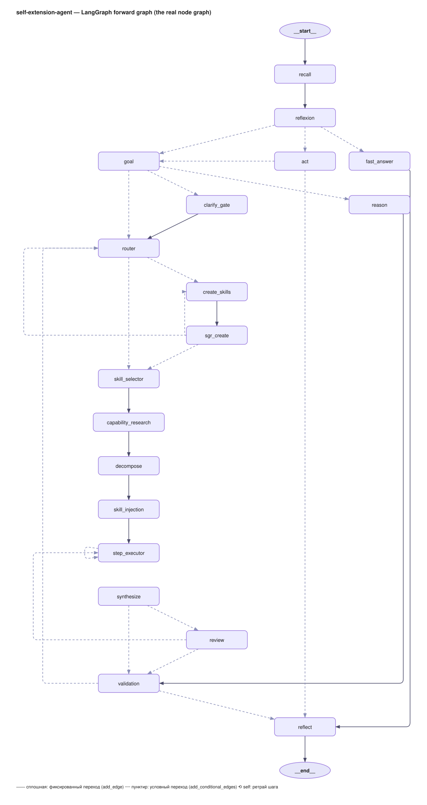
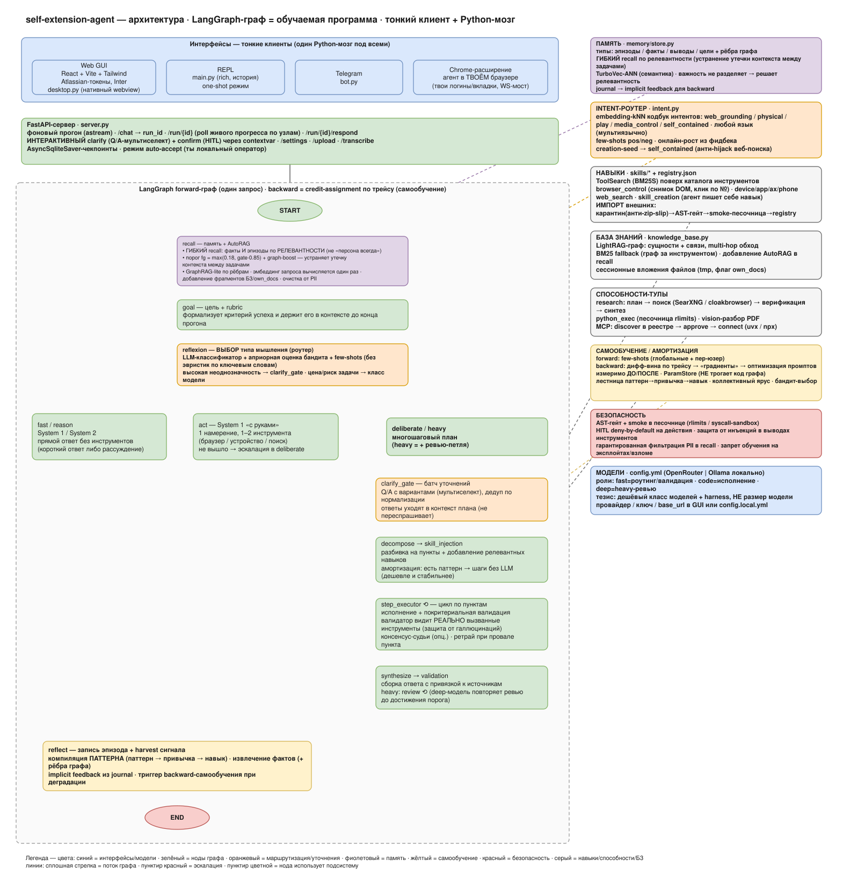

# self-extension-agent — Architecture

> 🇷🇺 **Русская версия — [ниже](#архитектура-self-extension-agent-русская-версия).**

A self-extending, self-improving agent on LangGraph. The agent's graph is treated as a
**trainable program**: a run = forward pass (a trace of node activations), and self-learning
is the backward pass over that trace.



> The real LangGraph forward graph (exact node/edge topology from `src/graph/agent.py`; **solid** =
> `add_edge`, **dashed** = `add_conditional_edges`), each node annotated with what it does. Source:
> [`scripts/gen_agent_graph.py`](scripts/gen_agent_graph.py) → editable
> [`docs/architecture.en.drawio`](docs/architecture.en.drawio) → SVG. The same graph is described
> step by step below.

## Forward graph (one request)

```
START
 └─ recall            memory (episodes/facts/conclusions/goals/summaries) + implicit feedback + external ctx
                      + AutoRAG (user KB + session attachments, BM25 + sanitize) + interaction-journal flush.
                      CONDITIONAL & FLEXIBLE ("recall is not always"): BOTH facts AND associative memory
                      (episodes/conclusions) are retrieved BY RELEVANCE to the query (recall_gate) — a
                      task-specific fact does NOT leak into an unrelated query; GraphRAG-lite boost survives.
                      The query is embedded ONCE → reused in gate/graph AND the intent router.
 └─ goal              goal-setting: aim + a "worthwhile" goal + rubric (kept in context)
 └─ reflexion         Self-Reflexion Choice: pick the TYPE of thinking from task analysis
                      (+ bandit prior: Beta/Thompson over the user's similar episodes, sees failures too;
                      + universal intent router: embedding-kNN route codebook, any language (routing regexes REMOVED);
                      heavy is NOT predicted — it is EARNED by runtime evidence in route_after_synthesize)
      ├─ fast      → fast_answer ───────────────────────────────→ reflect → END   (System 1, cheap)
      ├─ clarify   → fast_answer ───────────────────────────────→ reflect → END   (ask back)
      ├─ act       → act ───────────────────────────────────────→ reflect → END   (System 1 with hands:
      │                ONE direct action with 1–2 tools (BM25 skill pick, HITL kept);
      │                zero tool calls / ESCALATE → escalate to deliberate (→ goal)
      ├─ reason    → reason ─────────────────→ validation ──────→ reflect → END   (System 2, no tools)
      └─ deliberate / heavy → [clarify_gate?] → router → (create_skill | skill_selector)
                       clarify_gate — on medium ambiguity: a batch of clarifications
                       (markers/open) before execution; answers go into the run's
                       clarification registry, reused by decompose/step/synthesize; no answer
                       → reasonable assumption. Catch-up mid-step: the ask_user tool.
                       skill_selector → decompose → skill_injection
                          (amortization: with a PATTERN for a similar successful task the selector runs
                           with NO LLM call; at sim≥0.7 decompose runs with NO LLM — plan from pattern)
                          → step_executor⟲ (execution+validation PER ITEM,
                             the validator sees the ACTUALLY-called tools: text ≠ action)
                          → synthesize ─→ validation → reflect → END               (deliberate)
                                       └→ review (heavy: end-to-end review by the deep model)
                                            ├─ problems → fix sub-steps → step_executor⟲ → synthesize → validation
                                            └─ clean → validation
 reflect              write the episode (trajectory + interaction journal), harvest signal
                      (HITL refusal / clarify answer → profile facts), compile the PATTERN and
                      its win/lose, promote to the collective pool, detect a habit,
                      extract facts (+tags, edges), reflexion, summary, prune,
                      degradation tracking, auto self-learning
```

`create_skill` branch: ReAct builds a skill → SGR review + smoke test → load (L1 self-improvement, skill library).

## Two routing levels (do not conflate)

There are TWO routings, at different levels. The intent router does NOT pick the thinking mode — the LLM does.

```
                          query + qvec (query embedding, computed ONCE in recall)
                                              │
        ┌─────────────────────────────────────┴─────────────────────────────────────┐
        │                                                                             │
  LEVEL 1 — THINKING MODE ("how to think")              LEVEL 2 — INTENT SIGNALS ("what kind of request")
  decided by: reflexion-LLM (ReflexionDecision)         decided by: embedding-kNN codebook (intent.py) on qvec
  + bandit prior + similarity few-shots                 signals: web_grounding / physical_browser /
  output: fast | reason | act | deliberate | heavy |             play_media / media_control / self_contained
          clarify  (+ ambiguity/grounding scores)       NOT a mode — behavior GATES:
        │                                                  • web_grounding → OVERRIDES mode to act
        │                                                    (anti-hallucination FLOOR; classifier ONLY)
        │                                                  • physical_browser → inside act: physical browser vs headless
        │                                                  • play_media → inside act: push playback through
        │                                                  • media_control → inside act: pause/stop/volume (NO auto-play)
        │                                                  • self_contained → no floor fired → mode as the LLM chose
        └──────────────────────── execute by mode ─────────────────────────────┘
```

- **Level 1 (mode)** is a JUDGEMENT (complexity / ambiguity / "do I know the answer"); embeddings don't replace it — their contribution is a PRIOR (bandit) and few-shots, the final call is the LLM's.
- **Level 2 (intent)** is the CONTENT of the request (need web / hands / media); it's defined by semantics → embeddings are natural here and **fully replaced the Russian-lexicon regexes** (any language; routing regexes removed). web_grounding is the only signal that can override the mode (to act), because it is the anti-hallucination floor.

## Layers

| Layer | Files | Essence |
|---|---|---|
| Cognition / meta-control | `agent.py` (goal/reflexion/act/reason/decompose/step/synthesize nodes) | **6 thinking types** (fast/reason/act/deliberate/heavy/clarify; act = "System 1 with hands": a direct action without decomposition, the heavy pipeline only when a direct action isn't enough) + **reflexion-grounding** (assessing "can I answer this reliably myself" → grounding, anti-hallucination); goal-setting, decomposition, per-item execution |
| Memory | `memory/store.py` (SQLite, WAL + per-thread connection), `embedder.py`, `vector_index.py` (TurboVec), `feedback.py`, **`memory_tools.py`**, **`interaction.py`** | episodes/facts(+tags)/conclusions/goals/summaries + graph edges (prune now also evicts dangling edges + caps recipes); **CONDITIONAL & FLEXIBLE recall** (`recall_scored`+gate `recall_gate`: BOTH facts and associative memory retrieved by relevance to the query — "recall is not always", task-specific facts don't leak into unrelated queries; GraphRAG-lite boost survives the gate); **GraphRAG-lite** (`_densify_fact` fact↔fact by cosine + `_graph_boost` spreading-activation from relevant episode seeds, per-user, PII containment); the query is embedded ONCE (qvec threaded, not N HTTP calls); implicit feedback. **Interaction journal**: HITL/clarify survive the run → episode + harvest with no LLM. **Memory-as-tool (3 tiers)**: `search_memory` / `recall_history` / `note_to_self`. **Auto-memory scoped per chat** (`_mem_scope`=session_id): facts/goal/episodes/summary are per-thread — a new chat starts clean, no cross-chat goal bleed; per-USER amortization (few-shots/recipes/habits) stays cross-session (read-key=write-key audited) |
| Intent routing | **`intent.py`** · `eval/route_eval.py` | **universal embedding-kNN router** (any language): route codebook {web_grounding/physical_browser/play_media/media_control/self_contained}, cosine-kNN; **fully replaced the Russian-regex crutches — routing regexes are REMOVED**, all signals go through the classifier only. The 5th label media_control (pause/stop/volume) is split off from play_media so that "pause it" does not push playback. Reuses the query embedding from recall (0 extra calls), PINNED by model (tag+invalidation). **Grows from the feedback loop** (validated run→route); per-label threshold (`web_grounding=0.23`, tuned by confusion). A pos/neg CORPUS (`route_examples.db`) for future training of a local head. route_eval: **570 cases, 89.3%** [Wilson 86.5–91.6%] (media_control 93% · physical 96% · self_contained 91% · web_grounding 86% · play_media 80%, multilingual incl. JA/ZH/AR/KO/HI) |
| Skills | `tools/skill_creation.py`, `skills/*`, **`retrieval.py`** | registry, core protection, autosync; **ToolSearch** (BM25S skill retrieval as the library grows); `web_search` with context engineering (trafilatura→chunks→BM25S→vector-rerank, never feeds the full page); `device_control`; **`browser_control`** (+`browser_session.py`): structural ACTIONS in the browser — numbered DOM-element snapshot → click/type by number; visible Chromium with a persistent profile (logins persist), `browser_see` read-only, actions under HITL |
| User knowledge base | **`knowledge_base.py`** · **`lightrag_engine.py`** | TWO tiers: (1) GLOBAL KB — personal documents in a folder hierarchy, graph on **real LightRAG** (lightrag-hku: entities+relations, hybrid multi-hop retrieval), BM25 fallback without a key; (2) SESSION files (tier 3, tmp/<session_id>) — multimodal (pdf/image/audio/video), cleaned at the end. **AutoRAG**: recall auto-mixes relevant KB+session chunks via a CHEAP BM25 (per request; no LLM/embedding cost), with "own data" provenance AND `sanitize_tool_output` (a poisoned document is data, not commands); the deep LightRAG graph sits behind the `search_knowledge_base`/`search_attached_files` tools, used when the agent decides to dig; an `own_docs` state flag mutes a spurious clarify |
| Capability tools | **`research.py`** · **`compute.py`** · **`media.py`** · **`mcp_client.py`** | disciplined **research** (sub-question plan→search+snippets+read→fact VERIFICATION→synthesis, a dependent chain); a **compute layer** `python_exec` (exact counting in a sandbox — rlimits/kill); **vision PDF-figure reading** `read_pdf_figures` (render→vision, gated on a PDF being present); **data-MCP self-extension** `try_connect_discovered` (domain→discover→relevance filter→first LIVE remote MCP; movie/finance/weather connect live) |
| Self-learning / amortization | `improve/`, **`habits.py`**, **`bandit.py`**, **`collective.py`**, `memory/store.py: recipes` | forward harvest of few-shots (global + **per-user**, two-tier with baseline); backward: diff credit-assignment → per-node gradients → prompt optimization; **per-user backward** (`graph_backward_user`: lessons from the user's failures → their few-shots); **measurable accept/revert** (before/after run on cases) → ParamStore; **habits** (`habits.py`: k similar successful expensive runs → fact-directive → router builds a skill → the habit closes ✅); **mode bandit prior** (`bandit.py`: Beta/Thompson over the user's similar episodes, sees FAILURES too — absent from few-shots; the prior goes into reflexion's memory_context, not a dictate) |
| Tracing / diagnostics | `tracing/` | spans per node (data/traces.db), self-diagnosis, rotation |
| Security | `utils_validation.py` (AST gate, write + module-level), `tools/skill_creation.py` (load-time gate), `utils.py` (sandbox subprocess), `hitl.py` (human-in-the-loop), **`improve/safety.py`** | generated code: AST bans + smoke in an isolated process (rlimits/kill); **load-time gate** (`_load_skill_module`): a skill is gated BEFORE `exec_module` (HITL gates the *call*, but module-level code runs at *import*) by a three-tier trust policy (core=as-is · imported=module-level AST · orphan/generated=full AST) + mtime cache (no re-exec per step); side-effect tools — confirmation, deny by default; **anti-injection in tool/MCP/search outputs** (`sanitize_tool_output`); **anti-PII floor** (`strip_ungrounded_pii` cuts fabricated emails, leaves numbers; `redact_pii` in collective patterns) — "do not disclose" is the twin of "do not fabricate"; **anti-hallucination gates catalogued in one decision table** (`docs/anti_hallucination_gates.md`, pinned by characterization tests); training bans (don't change architecture/prompts, don't learn from a jailbreak). **Honest ceiling**: AST = parity, not a sandbox |
| External | `external/context.py` | A2A/MCP context in state (slot + plumbing) |
| Maintenance | `maintenance/dep_update.py` | safe auto-update of dependencies with health-check and rollback |
| Interfaces | **`cli.py`/`tui.py` (full-screen Textual TUI — default `sea`)**, `bot.py` (Telegram), `server.py` (FastAPI), **`frontend/` (React+Vite+Tailwind GUI)**, **`desktop.py`** (native window via pywebview), packaged **`SEA.app`** (macOS, `build_binary.py --app` → Launchpad). `main.py` is now one-shot/scripting only (REPL replaced by the TUI). | shared graph + shared memory. The GUI runs each turn as a background run with **live progress** (per-node steps via `astream`), an **"Answer now"** button (early finish from the gathered context using the fast model), download buttons for produced files, **interactive clarify** (Q/A multiselect card over `/run/{id}/respond`) and confirm, native file attach (`/attach_local`) + mic (server-side ffmpeg), thread history, and a settings panel (provider/models/key, work/thinking mode, extension token). Key/provider set from CLI (`sea key`) into a global user config; the packaged app runs in `~/Library/Application Support/SEA`. Brain stays Python; thin client + brain. |

## Repository layout (`src/`)

Modules are grouped into domain packages; imports are absolute (`src.<pkg>.<mod>`):

- **`graph/`** — the LangGraph agent + scaffolding: `agent`, `agent_experimental`, `schemas`, `subagents`, `intent`, `semantic_signals`
- **`llm/`** — model layer: `llm`, `prompts`, `structured_outputs`, `usage`
- **`interface/`** — human-facing I/O: `tui`, `cli`, `cli_art`, `server`, `chat_store`, `progress`, `compact`, `clarify`, `interaction`, `semantics`
- **`browser/`** — `browser_bridge`, `browser_session`
- **`data/`** — external data / RAG / MCP: `research`, `knowledge_base`, `lightrag_engine`, `mcp_client`
- **`search/`** — retrieval + amortization loops: `retrieval`, `bandit`, `collective`, `habits`
- **`runtime/`** — run infra: `run_context`, `runbudget`, `degradation`, `hitl`, `compute`, `sea_workspace`, `context_files`
- **`config/`** — `config_paths`, `core_config`, `cli_config`
- existing: **`memory/`** (+`memory_tools`), **`tools/`** (+`utils_validation`, `skills_import`), **`improve/`**, **`eval/`**, **`tracing/`**, **`external/`**, **`maintenance/`**, **`skills/`**
- top-level: `media.py`, `utils.py`, plus root `main.py` (one-shot/REPL) and `desktop.py`

Entry points: `sea` → `src.interface.cli:main_cli`; desktop server → `uvicorn src.interface.server:app`.

## Architectural principle: the amortized agent

For known patterns (ReAct, plan-execute, multi-agent) the marginal cost per task is
~constant. Here every successful run leaves an artifact that makes similar tasks
CHEAPER — an experience-compilation ladder: episode → few-shot → **pattern** (plan+skills;
`memory/store.py: recipes`) → habit (`habits.py`) → skill (code). For a similar task:
the selector takes skills from the pattern with NO LLM call; at sim≥0.7 decompose is also
LLM-free (plan from the pattern); win/lose tracking, a losing pattern self-deletes. Execution
is a ladder with checkable escalation (act → deliberate → heavy; up only on a
grounded failure).

**Within-session amortization — the findings cache (mode goes DOWN, not just up).** After a
heavy/multi-step run, `reflect` compresses the work (steps + result) into a digest and appends it to
`session_findings` — a **collection** carried in graph state by the checkpointer per `thread_id` (no
DB; this is the "local memory" of the chat). On the next turn `recall` injects the **semantically
closest** entries (top-k by cosine over the query embedding, threshold 0.30; not "all" — context
bloat, not "last" — loses earlier subtopics). Now a follow-up on an already-analyzed subject sees the
prior reasoning as context, and `reflexion` **compresses the mode** (deliberate → reason/fast) instead
of re-running the heavy graph; it re-escalates only when the cached context is genuinely insufficient
(the same grounded-evidence rule as the up-ladder). Deterministic, no extra LLM call; per-chat
isolated; empty in single-shot eval (no checkpointer → GAIA-neutral). See the recall/reflexion/reflect
nodes in the diagram.

**Empirics** (`scripts/amortize_bench.py`: one task list, cold vs warm pass of one
user_id): the warm pass is **−13% tokens with quality rising
conf 78%→98%** (a cold task failed at 18% solved at 95%). The key lesson, learned
from negative runs #1/#3: the experience artifact must **REPLACE LLM work**
(zero-LLM selector/decomposition), not annotate it — hints/few-shots/priors inflate the
context of every call and buy only reliability. Caveats: this is ONE paired cold→warm run over
4 tasks (not 4 independent samples) — a mechanism demo, not statistics; time is noisy with API
latency, confidence is the validator's self-assessment; a series with medians is still needed.
**Collective tier** (`collective.py`): a vetted personal pattern (winrate gate) →
best-practice installation with the source profile's fingerprint; to similar users — a recommendation
(query similarity + profile gate), the personal one always wins, poison/drift are filtered
(injections are not promoted, a losing global pattern self-deletes).

## Self-learning as "training the graph"

- **Forward**: each run writes `run_id`+node activations to the trace and the episode (outcome+confidence).
  Accepted deliberate runs → few-shots (generalization with no LLM). **Per-user
  vectorization**: few-shots are written BOTH to a personal store (`data/user_fewshots.json`,
  key = user_id, LRU-cap) AND to the global one. On injection into a step, PERSONAL
  examples (what worked for this exact person) come first, the global ones top up to k. "Accepted" =
  validated AND not a reaction to a prior bad answer (implicit-feedback marker `[neg]`).
  Prompt overrides stay global (spinning them per-user = overfit).
- **Backward** (`improve/graph_learn.py`):
  1. differential blame: `blame = failRate − successRate` (always-firing nodes aren't to blame);
  2. `_backward_gradients`: 1 LLM call over the batch → a textual "gradient" per blamed node;
  3. `optimize_role` for EACH blamed node → placeholder check + LLM judge + **measurable BEFORE/AFTER** (run on failure cases, kept only on real improvement, else revert) → `ParamStore`.
- **Per-user backward** (`graph_backward_user`): from the SPECIFIC user's failures + WHO they are (profile/roles), synthesizes corrective LESSONS → their personal few-shots (core frozen; writes only to that user's store). Triggered on per-user degradation. This is "optimization for the user" as the method.
- **Parameter registry** (`improve/prompt_store.py`, `data/params.json`): prompt-override + few-shots + tool descriptions per node. Reversible, revert in one command, never touches the sources.
- **Optimization policy** (what backward may change):
  - system prompts of KEY nodes (goal/reflexion/decompose/fast_answer/reason/step_executor/review/clarify_gate) — **FROZEN** (this is behavior design; `improve.optimize_core_prompts: false`);
  - prompts of **sub-agents-as-tools** (researcher, …) — optimizable;
  - the main improvement/personalization channel is **few-shots** (global + per-user);
  - **the graph architecture never changes** — structurally: backward writes only artifacts to ParamStore, not code/graph (the judge/analyzer may not "drop a node");
  - **training defense** (`improve/safety.py`): injection/jailbreak episodes are excluded from the batch BEFORE analysis — a ban on "learning from a breach of its own defense".
- A larger batch → a more reliable blame map and richer few-shots → systematic improvement.

## Config / environment

- `config.yml`: models, retries, `memory.*` (recall/embeddings/caps), `skills.protected/autosync`, `improve.*`.
- env: `OPEN_ROUTER_API_KEY` (required), `SEARXNG_URL` (opt., fresh private search), `OPENAI_API_KEY` (opt., embeddings).

## Surfaces (one brain, several front-ends)

`build_graph()` is the single brain; the surfaces differ only in how they take input, which HITL
channel they confirm through, and how they stream progress.

- **CLI (`sea`)** — terminal, **project-rooted**. `src/interface/cli.py::main_cli` is a thin entry: `sea
  --version|--help|init` answer instantly **without** loading the agent (the heavy warmup lives at
  `main.py` module level); REPL / one-shot lazily import `main`. `sea init` scaffolds `.sea/` and
  scans the repo into `SEA.md`. From the project root the agent picks up convention files —
  `SEA.md` (instructions), `MEMORY.md` (project memory index), `MCP.md` (user MCP registry),
  `SKILL.md` (external skills) — via `src/runtime/context_files.py`.
- **Desktop** — `desktop.py` spawns `uvicorn src.interface.server:app` in a daemon thread and opens a native
  OS window (`pywebview`, system webview, no Electron) at `http://127.0.0.1:<port>/`. The server
  builds the **same graph** and serves `/` (web UI), `/chat`→`/run/{id}` (background run via
  `astream`, per-node progress), the extension chat endpoint, and HITL over the web
  (`_server_clarifier`/`_server_confirmer`).
- **Telegram** — `bot.py`. **Chrome extension** — `extension/` + the `browser_bridge` WebSocket
  (acts in the user's real browser).

**Work modes** (cross-surface, presets of `hitl`): `manual`(ask) · `auto-accept`(edit-auto) ·
`auto` · `plan` (side-effect tools return a `[PLAN]` stub, the agent only plans). `run_bash`/file
edits go through this — `plan` blocks, `manual` asks, `auto` runs; accept/reject is logged to
`.sea/history/`.

**Skills are three-tier** (like memory): global/user (`src/skills/` + registry.json, cross-project,
validated by the 3-stage SGR gate) · project (`.sea/skills/`, default for agent-created skills when
a project is initialized) · external (`SKILL.md`). The `code` skill (glob/grep/tree/read +
edit/bash) is a global capability.

**No run limit: execution to natural completion, with an "answer now" option.** A run is not
interrupted by time, token count, or step count. The plan is bounded by itself (at most
`max_subtasks` subtasks, retry limits, and protection against repeating identical calls), so
execution reaches its natural end, including long-running tasks. The user can finish earlier: an
**"Answer now"** button is available from the start of a run and, via `POST /run/{id}/answer_now`,
asks the graph to assemble an answer from the context gathered so far using the fast model. The only
automatic stop is an absolute step ceiling that guards against looping (not a cost limit). As a
safeguard against indefinite waiting (not as a budget), the model-request timeout and network-request
timeouts are kept. Files the agent creates are delivered to the user as downloadable attachments
(`export_table`/`write_file` → `GET /artifact/{id}` and a download button in the interface), rather
than printed as text to copy.

## CLI commands

- `uvicorn src.interface.server:app` — API (chat/diagnose/memory/traces).
- `python -m src.improve --graph` — backward over the graph (credit assignment + per-node optimization).
- `python -m src.tracing` — self-diagnosis.
- `python -m src.maintenance` — dependency auto-update.
- `python scripts/amortize_bench.py` — amortization thesis check (paid live run).
- `python -m src.eval.route_eval` — statistical eval of the universal intent router (570 labeled multilingual cases incl. JA/ZH/AR/KO/HI).
- `python scripts/gaia_resilient.py N --jsonl <path>` — GAIA held-out, fault-tolerant (survives a native crash, resumes from JSONL).
- REPL: `/kb add|ls|mkdir|find` — knowledge base (LightRAG graph, with a cost estimate and HITL); `/attach <file>` — session attachment (tmp, cleaned); `/auto plan|ask|edit|off` — work mode; `/compact` (= `/compress`) — compress the session context into `COMPACT.md` (cumulative, representative; status bar shows window fill, auto at 1M); `/sync` — rebuild `SEA.md` from `COMPACT.md` (a natural step after `/compact`).

## Done from the previous TODO

- **Backward = trace-aware edge-gradient**: the tracer writes each node's output (`spans.output`), `run_trace(run_id)` gives the node→output chain; `_format_failure_chains` builds "node→output→…→final", and per-node gradients are distributed along edges (not naive co-activation).
- **Vision screenshot analysis**: `device_control.analyze_screen` = `capture_screen` + `media.describe_image` (multimodal fast call) in one step.
- **Real MCP/A2A client**: `mcp_client` (MultiServerMCPClient) + a TRUSTED allowlist + `discover_mcp` over a registry + a human-gate on untrusted; auto-connect in `capability_research`.
- **Cross-platform device core**: `open_url/open_app/capture_screen/analyze_screen/notify/speak` have macOS/Linux/Windows backends (chosen by `platform.system()`), degrading with a hint of what to install.
- **Sandbox**: rlimits+kill (always) + optional syscall isolation (bubblewrap/firejail on Linux, sandbox-exec on macOS) — `AGENT_SYSCALL_SANDBOX`.
- **Per-thread chat_history in the server**: a working buffer per `user_id` (on top of long memory).
- **Routing regexes removed → classifier-only**: web_grounding/physical_browser/play_media signals used to be regex∨classifier; now the embedding-kNN router is the single source (any language, no lexicon crutches). The 5th label media_control was added so "pause" doesn't push playback. Statistical guard: `route_eval` (570 multilingual cases, 89.3%).
- **Flexible recall + GraphRAG-lite**: BOTH facts and associative memory retrieved by relevance to the query (`recall_gate`) — not "persona always"; a task-specific fact (stack/service of one task) no longer leaks into an unrelated query; fact↔fact densify + spreading-activation; query embedded once and reused.
- **Anti-hallucination floors (deterministic)**: `strip_ungrounded_urls`/`strip_ungrounded_pii` (fabricated emails cut, numbers kept), degenerate-repeat and false-access-refusal guards; heavy review is EARNED by runtime evidence, not predicted.
- **Chat history / threads**: `chat_store.py` (`/chats` `/fav` `/compress` `/rename`) + LangGraph SqliteSaver checkpointing (`checkpoints.db`) — navigation, favorites, compression done.
- **Within-step context masking**: `_mask_old_tool_msgs` (agent.py) collapses old ToolMessages (beyond the last `keep`) into stubs while preserving `tool_call_id`/AIMessage pairing — kills the quadratic context growth of a long direct chain (browser: open→see→click→…), paired with tool-output compression (cap) + urllib-first page reads.
- **CLI settings layer**: a `/config` panel persists provider/model/work-mode/thinking-mode/grants to `config.local.yml` (merged over `config.yml`); provider switch openrouter↔ollama works from the CLI.
- **Desktop GUI + cross-platform packaging** — DONE: React+Vite+Tailwind front-end + `desktop.py` (pywebview native window) over the FastAPI brain; PyInstaller spec + CI matrix (ubuntu/macos/windows); pyproject gates macOS-only deps so `uv sync` works everywhere; console entry point.
- **Settings UI (full)** — DONE: in-window settings panel — provider, models per role (fast/code/deep), `base_url`, **API key with live validation** (`/settings` → `validate_credentials`), work & thinking mode, browser-extension token; persists to `config.local.yml`.
- **Interactive HITL/clarify over HTTP** — DONE: `/chat` starts a background run (astream), client polls `/run/{id}`; `clarify.set_clarifier`/`hitl.set_confirmer` surface as a multiselect Q/A card and a confirm card; answer posts to `/run/{id}/respond` and the run resumes. Live per-node progress (steps) is streamed; clarify answers are deduped within the run.
- **Import external skills (verify-before-register)** — DONE (`skills_import.py`): user folder/zip → quarantine (zip-slip guard) → AST gate (static) → smoke import in an isolated subprocess (rlimits) requiring ≥1 `@tool` → only on success copied to `src/skills/` + added to `registry.json`. Untrusted code never executes in the agent process.
- **Concurrency & security hardening (review-driven)** — DONE: (1) **load-time gate** closes exec-before-HITL — a skill's module-level code is AST-checked BEFORE `exec_module` (three-tier trust) + mtime cache (no per-step re-exec); (2) **per-run budget isolation** (`runbudget.run_scope` keyed by `run_id` at the server + Telegram request boundaries) so concurrent requests don't wipe each other's counter/deadline; (3) **SQLite WAL + per-thread connection** (background reflection writes in parallel without "database is locked") + **atomic intent-codebook write** (temp + `os.replace`); (4) `prune` now evicts dangling graph edges and caps recipes. First concurrency tests + a single anti-hallucination decision table (`docs/anti_hallucination_gates.md`) with characterization tests. Honest ceiling: AST = parity, not a sandbox.
- **Full per-request isolation + runtime sandbox (review-driven, round 2)** — DONE: (1) **`run_context`** (run_id + user_id at the request boundary) isolates ALL per-request state — budget, clarify/interaction ledgers, anti-typosquat domains, degradation counters, and **per-user HITL grants/work-mode** (one client's "yes, always" can't leak; only the operator's grants persist). State lives in run-id-keyed dicts, NOT a contextvar `.set()` in a node (set-in-node isn't visible to sibling nodes — empirically verified; boundary-set propagates down). (2) **Runtime skill sandbox**: untrusted skill tools invoke in a subprocess (`run_tool_sandboxed`), not in-process — closes exec-with-full-rights; `AGENT_SKILL_SANDBOX_NO_NET=1` for network lockdown. (3) **Injection detection → embeddings** (`_ContrastiveSignal`, multilingual, regex removed) + labeled corpus for a future classifier. (4) **Atomic registry + ParamStore writes** (lock + temp + `os.replace`). (5) **Revived budget hard-cut** (`BudgetExceeded(BaseException)` pierces broad `except`, armed at ×2 of run budget — fires only on intra-step explosion, GAIA-neutral). Honest ceiling: on bare macOS the subprocess gets rlimits but not FS-read/network isolation (needs bwrap/sandbox-exec).
- **Project-convention trust + bot allowlist (review-driven, round 3)** — DONE: the agent can run in an arbitrary cwd, so (1) `MCP.md` servers are **auto-trusted only with explicit `trusted: true`** (was default-true → a cloned repo's `MCP.md` could `uvx`/remote-run foreign code, anti-RCE); (2) `SEA.md`/`SKILL.md` content is **injection-checked per sentence** (embedding) before injection as instructions, cached by content hash — a malicious convention file is wrapped as data, not followed; (3) the Telegram bot gains a `TELEGRAM_ALLOWED_IDS` **chat_id allowlist** (outer middleware; empty → loud warning); (4) the `[[MEDIA_PLAYING]]` structural sentinel is **stripped from page-element text** so a page can't forge the playback verdict. The embedding injection seeds were broadened (exfiltration intent) after a real false-negative surfaced.
- **Injection→RCE checkpoint + cross-user PII + tracer/SSRF (review-driven, round 4)** — DONE: (1) **`auto-accept` no longer bypasses HITL for dangerous tools** (`run_bash`/`edit_file` + any imported skill): a tool command can come from an LLM steered by web-content injection, so the convenience default must not silently shell-exec — only full `auto` (an explicit autonomy opt-in) or a per-tool grant skips the checkpoint (`hitl._is_dangerous`, config `skills.dangerous`). (2) **Collective recipe promotion redacts the WHOLE cross-user surface** — not just `query` but `plan` step leaves (recursive `_redact_struct`) and the source `profile` (role-fact values), since both echo task specifics across the user boundary. (3) **Tracer on per-thread connection + WAL** (`tracing/tracer.py`, the pattern `memory_store` already adopted) — `record()` fires on every node + the background reflect thread; the old single shared conn with commit-per-node serialized concurrent requests and could throw `OperationalError`. (4) **SSRF denylist for LLM-driven `browse`/`read_url`** (`web_search._ssrf_blocked`): injection-steered fetches to loopback/link-local/RFC1918/cloud-metadata (169.254.169.254) are rejected; `search_web` is unaffected (operator-config host). (5) **`device_control.notify`/`speak` now escape** the LLM-controlled message/title into the osascript (`_esc`) and PowerShell (`_ps_esc`, `'`→`''`) literals — `notify` is in `_DEFAULT_READONLY` (never hits HITL), so raw interpolation there was injection→RCE *without any checkpoint* (sharper than SEC-1; the SEC-2 fix had patched `app_control` but missed this sibling). (6) **`cli_config.set_cli` is now atomic+locked** (the whole read-modify-write in one critical section + temp/fsync/`os.replace`) — it stores `api_key`/grants and was the last config writer not hardened. Verified-stale: the osascript "no-escaping" claim against `app_control` — `_esc()` already neutralizes `\`/`"` there.
- **Read-exfiltration checkpoint + last atomic writer (review-driven, round 5)** — DONE: (1) **`code` file-read tools are scoped to the project root + a secret denylist** (`src/skills/code`: `_safe_path`/`_is_secret_file`). `read_lines`/`grep_repo`/`glob_files`/`list_tree` are in `_DEFAULT_READONLY` (never confirmed), so without scoping an injection-steered agent could `read_lines('.env')` and exfiltrate the key via an *external* `browse` (the SSRF denylist blocks internal, not external) — the read twin of the closed `run_bash` RCE. Now every path is resolved and kept inside `AGENT_PROJECT_ROOT`/cwd (`.resolve()` catches symlink/`..` escape), secret files (`.env`/`id_rsa`/`*.pem`/`*.key`/`credentials`/…) are unreadable even inside the repo, and `edit_file` (write) is scoped the same way; `grep_repo` excludes secrets in both the ripgrep fast-path and the python fallback. Pointing the skill at another project = explicit `AGENT_PROJECT_ROOT`. (2) **`project_memory` index write is atomic + locked** (`memory/project_memory.py`, CON-3) — `add()` did a non-atomic read-modify-write of `MEMORY.md`, so concurrent runs (multi-client) could lose a pointer line and `block()` could see a torn read; now the RMW is one critical section + temp/fsync/`os.replace` (the pattern intent/ParamStore/registry/cli_config/tracer already adopted — this was the last unhardened writer). GAIA-neutral: read tools aren't in the web-research forward path; scoping is active only when a task actually touches project files. Tests +2 (scoping/secret-block; concurrent-add no-loss).

## Known boundaries (TODO)
- **Trained parametric route head** — an ONLINE-adaptive kNN head already exists: `classify` is cosine 1-NN per label, and `add_exemplar` grows the codebook from the feedback loop ON SUCCESS only (agent.py:2050, capped per label). A pos/neg corpus (`route_examples.db`) also accrues (`log_route_example`, positives AND negatives). STILL deferred: training a *parametric* model over that corpus (CatBoost / contrastive / fine-tuned embedder) and actually CONSUMING the negatives — today kNN reads only positive codebook exemplars; reward=0 rows just accumulate for future training.
- **play_media ↔ media_control overlap** — the two are semantically close, so ~20% of play lands in control (route_eval play_media 80%); kept on purpose because a pause misfiring into auto-play is worse than play losing only its deterministic nudge.
- The syscall sandbox is optional and depends on bwrap/firejail; a full gVisor/container per smoke is the next level.
- Working with ALREADY-OPEN windows (keystroke/scroll/AX, phone/adb) — macOS only so far; a cross-platform UI-automation layer is next.
- Orchestration = picking 1 of 6 fixed mode-templates (fast/reason/act/deliberate/heavy/clarify), each a baked-in node pipeline; the escalation ladder (act→deliberate→earned-heavy) is the only runtime deviation. NEXT (not "chain several whole modes" — that's still templates): dissolve modes into atomic cognitive PRIMITIVES (recall/reason/tool-act/verify/decompose/reflect) and let a meta-controller COMPOSE them per task from intermediate results (router-picks-1-of-N → planner-assembles-a-compute-graph). Modes would then be just frequent baked patterns, not the only options. **Being prototyped behind a flag in `src/graph/agent_experimental.py` (experimental, isolated from the working graph).**
- **Cross-turn history rewrite** — within-step masking is done (above), but rewriting the message history ACROSS turns stays out: it's owned by LangGraph `create_agent` and a rewrite there is a fragile hack.
- **LightRAG** works for the user's KB documents (`knowledge_base.py`); for GLOBAL memory (episodes/facts) it's GraphRAG-lite — **typed edges already exist** (`memory_edges.relation`: `similar` fact↔fact by cosine, `derived` episode→fact) and **multi-hop traversal exists** (`_graph_boost` spreading-activation over `graph_hops`, config-gated to 1), on top of recency+relevance+importance + TurboVec-ANN. Still the next level vs full LightRAG: **LLM-extracted semantic relation types** (entities+relations, not just structural similar/derived) and a dedicated **graph-query retrieval mode** (today the graph only re-weights recall, it isn't a standalone retriever).
- Amortization: n=4 statistics (a series with medians is needed); LLM-abstraction of a pattern (strip a specific user's particulars) before collective promotion (privacy in a multi-user deploy); inheriting strong MCPs via a before/after comparison.

---
---

# Архитектура self-extension-agent (Русская версия)

Самораширяющийся, самообучающийся агент на LangGraph. Граф агента трактуется как
**обучаемая программа**: прогон = forward pass (трейс активаций), а self-learning —
backward pass по этому трейсу.



> Реальный forward-граф LangGraph (точная топология нод/рёбер из `src/graph/agent.py`; **сплошная** =
> `add_edge`, **пунктир** = `add_conditional_edges`), каждая нода подписана — что в ней происходит.
> Источник: [`scripts/gen_agent_graph.py`](scripts/gen_agent_graph.py) → редактируемая
> [`docs/architecture.drawio`](docs/architecture.drawio) → SVG. Тот же граф пошагово описан ниже.

## Forward-граф (один запрос)

```
START
 └─ recall            память (эпизоды/факты/выводы/цели/саммари) + implicit feedback + external ctx
                      + AutoRAG (БЗ юзера + вложения сессии, BM25 + sanitize) + сброс журнала взаимодействий.
                      УСЛОВНЫЙ И ГИБКИЙ («recall не всегда»): И факты, И ассоциативная память отбираются
                      ПО РЕЛЕВАНТНОСТИ к запросу (recall_gate) — task-факт одной задачи НЕ течёт в
                      несвязанный запрос; GraphRAG-lite (densify fact↔fact + spreading-
                      activation). Запрос эмбеддится ОДИН раз → переиспускается в gate/graph И intent-роутере.
 └─ goal              целеполагание: aim + «стоящая» цель + rubric (держится в контексте)
 └─ reflexion         Self-Reflexion Choice: выбор ТИПА мышления по анализу задачи
                      (+ априорная оценка бандита: Beta/Thompson по похожим эпизодам юзера, видит и неудачи;
                      + universal intent-роутер: embedding-kNN кодбук маршрутов любой язык (регулярные выражения маршрутизации УДАЛЕНЫ);
                      heavy НЕ предсказывается — ЗАРАБАТЫВАЕТСЯ рантайм-evidence в route_after_synthesize)
      ├─ fast      → fast_answer ───────────────────────────────→ reflect → END   (System 1, дёшево)
      ├─ clarify   → fast_answer ───────────────────────────────→ reflect → END   (переспросить)
      ├─ act       → act ───────────────────────────────────────→ reflect → END   (System 1 с руками:
      │                ОДНО прямое действие 1–2 инструментами (BM25-подбор навыка, HITL сохранён);
      │                ни одного вызова инструмента / ESCALATE → эскалация в deliberate (→ goal)
      ├─ reason    → reason ─────────────────→ validation ──────→ reflect → END   (System 2, без инструментов)
      └─ deliberate / heavy → [clarify_gate?] → router → (create_skill | skill_selector)
                       clarify_gate — при средней неоднозначности: батч уточнений
                       (маркеры/открытые) перед исполнением; ответы в реестр уточнений
                       прогона, переиспользуются decompose/step/synthesize; нет ответа
                       → разумное допущение. Догон в шаге: инструмент ask_user.
                       skill_selector → decompose → skill_injection
                          (амортизация: при ПАТТЕРНЕ похожей успешной задачи селектор БЕЗ
                           LLM-вызова; при sim≥0.7 и decompose БЕЗ LLM — план из паттерна)
                          → step_executor⟲ (исполнение+валидация ПО ПУНКТАМ,
                             валидатор видит РЕАЛЬНО вызванные инструменты: текст ≠ действие)
                          → synthesize ─→ validation → reflect → END               (deliberate)
                                       └→ review (heavy: сквозной ревью deep-моделью)
                                            ├─ проблемы → fix-подшаги → step_executor⟲ → synthesize → validation
                                            └─ чисто → validation
 reflect              запись эпизода (trajectory + журнал взаимодействий), harvest сигнала
                      (HITL-отказ/clarify-ответ → факты профиля), компиляция ПАТТЕРНА и
                      win/lose применённого, промоушен в коллективный пул, детекция привычки,
                      извлечение фактов(+тэги, рёбра), рефлексия, саммари, prune,
                      трекинг деградации, авто-self-learning
```

`create_skill`-ветка: ReAct создаёт навык → SGR-ревью + smoke-тест → загрузка (L1 self-improvement, skill library).

## Два уровня маршрутизации (НЕ путать)

Маршрутизаций ДВЕ, на разных уровнях. Intent-роутер НЕ выбирает режим мышления — это делает LLM.

```
                          запрос + qvec (эмбеддинг запроса, посчитан в recall ОДИН раз)
                                              │
        ┌─────────────────────────────────────┴─────────────────────────────────────┐
        │                                                                             │
  УРОВЕНЬ 1 — РЕЖИМ МЫШЛЕНИЯ («как думать»)              УРОВЕНЬ 2 — INTENT-СИГНАЛЫ («что за запрос»)
  кто решает: reflexion-LLM (ReflexionDecision)         кто решает: embedding-kNN кодбук (intent.py) на qvec
  + априорная оценка бандита + similarity few-shots     сигналы: web_grounding / physical_browser /
  выход: fast | reason | act | deliberate | heavy |              play_media / media_control / self_contained
         clarify  (+ ambiguity/grounding-оценки)        НЕ режим — ГЕЙТЫ поведения:
        │                                                  • web_grounding → ПЕРЕБИВАЕТ режим на act
        │                                                    (анти-галлюц. ПОЛ; ТОЛЬКО классификатор)
        │                                                  • physical_browser → внутри act: физ-браузер vs headless
        │                                                  • play_media → внутри act: дожим воспроизведения
        │                                                  • media_control → внутри act: пауза/стоп/громкость (БЕЗ авто-дожима)
        │                                                  • self_contained → ни один пол не сработал → режим как выбрал LLM
        └──────────────────────── исполнение по режиму ────────────────────────┘
```

- **Уровень 1 (режим)** — это СУЖДЕНИЕ (сложность/неоднозначность/«знаю ли я ответ»), embeddings его не заменяют; их вклад — как ПРАЙОР (бандит) и few-shots, финальное решение за LLM.
- **Уровень 2 (intent)** — это СОДЕРЖАНИЕ запроса (нужен веб/руки/медиа), оно определяется семантикой → embeddings тут естественны и **полностью заменили регулярные выражения по русскому лексикону** (любой язык; регулярные выражения маршрутизации удалены). web_grounding — единственный сигнал, что может перебить режим (на act), потому что это анти-галлюцинационный пол.

## Слои

| Слой | Файлы | Суть |
|---|---|---|
| Когниция / мета-контроль | `agent.py` (goal/reflexion/act/reason/decompose/step/synthesize ноды) | **6 типов мышления** (fast/reason/act/deliberate/heavy/clarify; act = «System 1 с руками»: прямое действие без декомпозиции, тяжёлый пайплайн — только когда прямого действия не хватает) + **reflexion-grounding** (оценка «могу ли достоверно ответить сам» → заземление, анти-галлюцинация); целеполагание, декомпозиция, по-пунктовое исполнение |
| Память | `memory/store.py` (SQLite, WAL + пер-поточный conn), `embedder.py`, `vector_index.py` (TurboVec), `feedback.py`, **`memory_tools.py`**, **`interaction.py`** | эпизоды/факты(+тэги)/выводы/цели/саммари + граф-рёбра (prune теперь чистит и повисшие рёбра + капает рецепты); **УСЛОВНЫЙ И ГИБКИЙ recall** (`recall_scored`+гейт `recall_gate`: И факты, И ассоциативная память отбираются по релевантности к запросу — «recall не всегда», task-факты не текут в несвязанные запросы; граф-boost переживает гейт); **GraphRAG-lite** (`_densify_fact` fact↔fact по cosine + `_graph_boost` spreading-activation от релевантных эпизод-сидов, per-user, PII-контейнмент); запрос эмбеддится ОДИН раз (qvec прокидывается, не N HTTP-вызовов); implicit feedback. **Журнал взаимодействий**: HITL/clarify переживают прогон → эпизод + harvest без LLM. **Память-как-tool (3 яруса)**: `search_memory` / `recall_history` / `note_to_self`. **Авто-память скоупится по чату** (`_mem_scope`=session_id): facts/goal/episodes/summary — по треду (новый чат стартует чистым, цель не течёт между чатами); per-USER амортизация (few-shots/рецепты/привычки) — кросс-сессионно (write-key=read-key проверены) |
| Маршрутизация интентов | **`intent.py`** · `eval/route_eval.py` | **универсальный embedding-kNN роутер** (любой язык): кодбук маршрутов {web_grounding/physical_browser/play_media/media_control/self_contained}, cosine-kNN; **полностью заменил костыли на регулярных выражениях по русскому лексикону — регулярные выражения маршрутизации УДАЛЕНЫ**, все сигналы идут только через классификатор. 5-й лейбл media_control (пауза/стоп/громкость) отделён от play_media, чтобы «поставь паузу» не запускало воспроизведение. Переиспускает query-эмбеддинг из recall (0 лишних вызовов), ФИКСИРОВАН по модели (тег+инвалидация). **Растёт из фидбек-лупа** (валидированный прогон→маршрут); per-label порог (`web_grounding=0.23`, тюнинг по confusion). КОРПУС pos/neg (`route_examples.db`) для будущего обучения локального head. Стат-оценка route_eval: **570 кейсов, 89.3%** [Wilson 86.5–91.6%] (media_control 93% · physical 96% · self_contained 91% · web_grounding 86% · play_media 80%, мультиязык вкл. JA/ZH/AR/KO/HI) |
| Навыки | `tools/skill_creation.py`, `skills/*`, **`retrieval.py`** | реестр, защита core, автосинк; **ToolSearch** (BM25S-retrieval навыков при росте библиотеки); `web_search` с контекстным инжинирингом (trafilatura→чанки→BM25S→vector-rerank, полную страницу не кормит); `device_control`; **`browser_control`** (+`browser_session.py`): структурные ДЕЙСТВИЯ в браузере — снимок DOM-элементов с номерами → клик/ввод по номеру; видимый Chromium с постоянным профилем (логины живут), `browser_see` read-only, действия под HITL |
| База знаний юзера | **`knowledge_base.py`** · **`lightrag_engine.py`** | ДВА яруса: (1) ГЛОБАЛЬНАЯ БЗ — персональные документы в иерархии папок, граф на **настоящем LightRAG** (lightrag-hku: сущности+связи, гибридный multi-hop retrieval), BM25 fallback без ключа; (2) СЕССИОННЫЕ файлы (ярус 3, tmp/<session_id>) — мультимодальные (pdf/image/audio/video), чистятся в конце. **AutoRAG**: recall авто-подмешивает релевантные куски БЗ+сессии через ДЕШЁВЫЙ BM25 (на каждый запрос; без LLM/эмбеддинг-трат), с провенансом «свои данные» И `sanitize_tool_output` (отравленный документ — данные, не команды); глубокий LightRAG-граф — за инструментами `search_knowledge_base`/`search_attached_files`, когда агент сам решает копать; флаг `own_docs` в state глушит мнимый clarify |
| Способности-инструменты | **`research.py`** · **`compute.py`** · **`media.py`** · **`mcp_client.py`** | дисциплинированный **research** (план под-вопросов→поиск+сниппеты+чтение→ВЕРИФИКАЦИЯ факта→синтез, зависимая цепочка); **вычислительный слой** `python_exec` (точный счёт в песочнице — rlimits/kill); **vision-чтение фигур PDF** `read_pdf_figures` (рендер→vision, гейт по наличию PDF); **data-MCP само-расширение** `try_connect_discovered` (домен→discover→фильтр релевантности→первый ЖИВОЙ remote-MCP; movie/finance/weather подключаются живьём) |
| Самообучение / амортизация | `improve/`, **`habits.py`**, **`bandit.py`**, **`collective.py`**, `memory/store.py: recipes` | forward-харвест few-shots (глоб+**пер-юзер**, двухъярусно с baseline); backward: дифф-credit-assignment → per-node gradients → оптимизация промптов; **per-user backward** (`graph_backward_user`: уроки из неудач юзера → его few-shots); **измеримый accept/revert** (прогон ДО/ПОСЛЕ на кейсах) → ParamStore; **привычки** (`habits.py`: k похожих успешных дорогих прогонов → факт-директива → router создаёт навык → привычка закрывается ✅); **априорная оценка режима, бандит** (`bandit.py`: Beta/Thompson по похожим эпизодам юзера, видит и НЕУДАЧИ — в few-shots их нет; априорная оценка в memory_context reflexion, не диктат) |
| Трейсинг/диагностика | `tracing/` | спаны по нодам (data/traces.db), самодиагностика, ротация |
| Безопасность | `utils_validation.py` (AST-гейт: запись + уровень модуля), `tools/skill_creation.py` (гейт загрузки), `utils.py` (песочница-подпроцесс), `hitl.py` (human-in-the-loop), **`improve/safety.py`** | генерируемый код: AST-запреты + smoke в изолированном процессе (rlimits/kill); **гейт загрузки** (`_load_skill_module`): навык гейтится ПЕРЕД `exec_module` (HITL гейтит *вызов*, но module-level код идёт при *импорте*) по трёхуровневой модели доверия (core=как есть · imported=AST уровня модуля · orphan/сгенерированное=полный AST) + кэш по mtime (нет ре-exec на шаг); side-effect инструменты — подтверждение, deny by default; **защита от инъекций в выводах инструментов/MCP/поиска** (`sanitize_tool_output`); **гарантированная фильтрация PII** (`strip_ungrounded_pii` режет выдуманные email, числа не трогает; `redact_pii` в коллективных паттернах) — «не разглашать» = близнец «не выдумывать»; **анти-галлюцинационные гейты собраны в единую decision-таблицу** (`docs/anti_hallucination_gates.md`, закреплены характеризационными тестами); запреты обучения (не менять архитектуру/промпты, не учиться на взломе). **Честный потолок**: AST = паритет, не песочница |
| Внешнее | `external/context.py` | контекст A2A/MCP в состоянии (слот + плумбинг) |
| Обслуживание | `maintenance/dep_update.py` | безопасный авто-апдейт зависимостей с health-check и откатом |
| Интерфейсы | **`cli.py`/`tui.py` (полноэкранный Textual TUI — дефолтный `sea`)**, `bot.py` (Telegram), `server.py` (FastAPI), **`frontend/` (React+Vite+Tailwind GUI)**, **`desktop.py`** (нативное окно через pywebview), упакованный **`SEA.app`** (macOS, `build_binary.py --app` → Launchpad). `main.py` — теперь только one-shot/скрипты (REPL заменён TUI). | общий граф + общая память. GUI гонит каждый ход как фоновый прогон с **живым прогрессом** (шаги по узлам через `astream`), кнопкой **«Ответить сейчас»** (досрочное завершение по накопленному контексту, быстрая модель), кнопками загрузки созданных файлов, **интерактивным clarify** (Q/A-мультиселект через `/run/{id}/respond`) и подтверждением, нативное прикрепление файлов (`/attach_local`) + микрофон (ffmpeg на сервере), история тредов, панель настроек (провайдер/модели/ключ, режимы, токен расширения). Ключ/провайдер из CLI (`sea key`) в глобальный конфиг; упакованное приложение работает в `~/Library/Application Support/SEA`. Мозг — Python; тонкий клиент + мозг. |

## Раскладка репозитория (`src/`)

Модули сгруппированы в доменные подпакеты; импорты абсолютные (`src.<pkg>.<mod>`):

- **`graph/`** — граф LangGraph + обвязка: `agent`, `agent_experimental`, `schemas`, `subagents`, `intent`, `semantic_signals`
- **`llm/`** — модельный слой: `llm`, `prompts`, `structured_outputs`, `usage`
- **`interface/`** — человеко-facing I/O: `tui`, `cli`, `cli_art`, `server`, `chat_store`, `progress`, `compact`, `clarify`, `interaction`, `semantics`
- **`browser/`** — `browser_bridge`, `browser_session`
- **`data/`** — внешние данные / RAG / MCP: `research`, `knowledge_base`, `lightrag_engine`, `mcp_client`
- **`search/`** — retrieval + контуры амортизации: `retrieval`, `bandit`, `collective`, `habits`
- **`runtime/`** — рантайм-инфра: `run_context`, `runbudget`, `degradation`, `hitl`, `compute`, `sea_workspace`, `context_files`
- **`config/`** — `config_paths`, `core_config`, `cli_config`
- существующие: **`memory/`** (+`memory_tools`), **`tools/`** (+`utils_validation`, `skills_import`), **`improve/`**, **`eval/`**, **`tracing/`**, **`external/`**, **`maintenance/`**, **`skills/`**
- верхний уровень: `media.py`, `utils.py`, плюс корневые `main.py` (one-shot/REPL) и `desktop.py`

Точки входа: `sea` → `src.interface.cli:main_cli`; desktop-сервер → `uvicorn src.interface.server:app`.

## Архитектурный принцип: амортизированный агент

У известных паттернов (ReAct, plan-execute, multi-agent) предельная стоимость задачи
~постоянна. Здесь каждый успешный прогон оставляет артефакт, делающий похожие задачи
ДЕШЕВЛЕ — лестница компиляции опыта: эпизод → few-shot → **паттерн** (план+навыки;
`memory/store.py: recipes`) → привычка (`habits.py`) → навык (код). Похожая задача:
селектор берёт навыки из паттерна БЕЗ LLM-вызова; при sim≥0.7 decompose тоже БЕЗ LLM
(план из паттерна); win/lose-трекинг, проигрывающий паттерн самоудаляется. Исполнение —
лестница с проверяемой эскалацией (act → deliberate → heavy; вверх только по
заземлённому провалу).

**Амортизация в рамках сессии — findings-кэш (режим идёт ВНИЗ, не только вверх).** После
тяжёлого/мультишагового прогона `reflect` сжимает работу (шаги + итог) в выжимку и добавляет в
`session_findings` — **коллекцию**, которую чекпоинтер несёт в state по `thread_id` (без БД; это
«локальная память» чата). Следующий ход `recall` впрыскивает **семантически ближайшие** записи (top-k
по косинусу к эмбеддингу запроса, порог 0.30; не «все» — раздув контекста, не «последняя» — теряет
ранние подтемы). Теперь follow-up по уже разобранному видит прошлое рассуждение как контекст, и
`reflexion` **сжимает режим** (deliberate → reason/fast) вместо повтора тяжёлого графа; эскалация назад
— только когда кэша реально не хватает (то же правило заземлённого evidence, что и вверх по лестнице).
Детерминированно, без лишнего LLM-вызова; изолировано по чату; пусто в single-shot бенче (нет
чекпоинтера → GAIA-нейтрально). См. ноды recall/reflexion/reflect на схеме.

**Эмпирика** (`scripts/amortize_bench.py`: один список задач, cold vs warm проход одного
user_id): тёплый проход **−13% токенов при росте
качества conf 78%→98%** (проваленная холодная задача 18% решена на 95%). Ключевой урок,
добытый отрицательными прогонами №1/№3: артефакт опыта должен **ЗАМЕНЯТЬ LLM-работу**
(zero-LLM селектор/декомпозиция), а не аннотировать её — подсказки/few-shots/априорные оценки раздувают
контекст всех вызовов и покупают только надёжность. Оговорки: это ОДИН парный прогон cold→warm
на 4 задачах (не 4 независимых сэмпла) — демонстрация механизма, не статистика; время шумит
латентностью API, confidence — самооценка валидатора; для строгости нужна серия с медианами.
**Коллективный ярус** (`collective.py`): проверенный личный паттерн (winrate-гейт) →
best-practice инсталляции с отпечатком профиля источника; похожим юзерам — рекомендация
(запрос-сходство + профиль-гейт), личное всегда приоритетнее, отрава/дрейф отсеиваются
(инъекции не промоутятся, проигрывающий глобальный паттерн самоудаляется).

## Self-learning как «обучение графа»

- **Forward**: каждый прогон пишет `run_id`+активации нод в трейс и эпизод (исход+confidence).
  Принятые обдуманные прогоны → few-shots (генерализация без LLM). **Векторизация под
  пользователя**: few-shots пишутся И в персональный стор (`data/user_fewshots.json`,
  ключ = user_id, LRU-cap), И в глобальный. При инъекции в шаг сначала идут ПЕРСОНАЛЬНЫЕ
  примеры (что заходило именно этому человеку), глобальные добивают до k. «Принят» =
  валидирован И не реакция на прошлый плохой ответ (implicit-feedback маркер `[neg]`).
  Промпт-оверрайды остаются глобальными (per-user их крутить — оверфит).
- **Backward** (`improve/graph_learn.py`):
  1. дифференциальная вина: `blame = failRate − successRate` (срабатывающие всегда ноды не виноваты);
  2. `_backward_gradients`: 1 LLM-вызов по батчу → текстовый «градиент» на каждую виноватую ноду;
  3. `optimize_role` для КАЖДОЙ виноватой ноды → проверка плейсхолдеров + LLM-судья + **измеримый ДО/ПОСЛЕ** (прогон на кейсах неудач, сохраняем только при реальном улучшении, иначе откат) → `ParamStore`.
- **Per-user backward** (`graph_backward_user`): из неудач КОНКРЕТНОГО юзера + того, КТО он (профиль/роли), синтезирует корректирующие УРОКИ → его персональные few-shots (ядро заморожено; пишет только в стор этого юзера). Триггер при per-user деградации. Это «оптимизация под пользователя» как метод.
- **Реестр параметров** (`improve/prompt_store.py`, `data/params.json`): prompt-override + few-shots + описания инструментов на ноду. Обратимо, revert одной командой, не трогает исходники.
- **Политика оптимизации** (что backward вправе менять):
  - системные промпты КЛЮЧЕВЫХ нод (goal/reflexion/decompose/fast_answer/reason/step_executor/review/clarify_gate) — **ЗАМОРОЖЕНЫ** (это дизайн поведения; `improve.optimize_core_prompts: false`);
  - промпты **саб-агентов-как-инструментов** (researcher, …) — оптимизируемы;
  - основной канал улучшения/персонализации — **few-shots** (глобальные + пер-юзер);
  - **архитектура графа никогда не меняется** — структурно: backward пишет только артефакты в ParamStore, не код/граф (судья/анализатор не вправе «выкинуть ноду»);
  - **защита обучения** (`improve/safety.py`): эпизоды-инъекции/джейлбреки исключаются из батча ДО анализа — запрет на «обучение по взлому собственной защиты».
- Батч больше → надёжнее карта вины и богаче few-shots → systematic improvement.

## Конфиг / окружение

- `config.yml`: модели, retries, `memory.*` (recall/embeddings/caps), `skills.protected/autosync`, `improve.*`.
- env: `OPEN_ROUTER_API_KEY` (обяз.), `SEARXNG_URL` (опц., свежий приватный поиск), `OPENAI_API_KEY` (опц., эмбеддинги).

## Поверхности (один мозг, несколько фронтов)

`build_graph()` — единый мозг; поверхности отличаются только тем, как берут ввод, каким каналом
HITL подтверждают и как стримят прогресс.

- **CLI (`sea`)** — терминальная, **project-rooted**. `src/interface/cli.py::main_cli` — лёгкий вход: `sea
  --version|--help|init` отвечают мгновенно **без** загрузки агента (тяжёлый прогрев — на уровне
  модуля `main.py`); REPL / one-shot лениво импортируют `main`. `sea init` создаёт `.sea/` и сканит
  репо в `SEA.md`. Из корня проекта агент подцепляет файлы-конвенции — `SEA.md` (инструкции),
  `MEMORY.md` (индекс проектной памяти), `MCP.md` (реестр MCP), `SKILL.md` (внешние навыки) — через
  `src/runtime/context_files.py`.
- **Десктоп** — `desktop.py` поднимает `uvicorn src.interface.server:app` в daemon-потоке и открывает нативное
  окно ОС (`pywebview`, системный webview, без Electron) на `http://127.0.0.1:<port>/`. Сервер
  строит **тот же граф** и отдаёт `/` (web-UI), `/chat`→`/run/{id}` (фоновый прогон через `astream`,
  прогресс по нодам), чат-эндпоинт расширения и HITL через веб (`_server_clarifier`/`_server_confirmer`).
- **Telegram** — `bot.py`. **Chrome-расширение** — `extension/` + WebSocket `browser_bridge`
  (действия в реальном браузере пользователя).

**Режимы работы** (сквозные, пресеты `hitl`): `manual`(ask) · `auto-accept`(edit-auto) · `auto` ·
`plan` (side-effect тулзы возвращают `[PLAN]`-стаб, агент только планирует). `run_bash`/правки
файлов проходят через это — `plan` блокирует, `manual` спрашивает, `auto` выполняет; accept/reject
логируется в `.sea/history/`.

**Навыки трёхъярусны** (как память): глобальные/user (`src/skills/` + registry.json, кросс-проект,
гейт 3-ступенчатой SGR-валидации) · проектные (`.sea/skills/`, дефолт для агент-создаваемых навыков
в инициализированном проекте) · внешние (`SKILL.md`). Навык `code` (glob/grep/tree/read +
edit/bash) — глобальная способность.

**Без ограничения прогона: выполнение до естественного завершения, с возможностью «ответить
сейчас».** Прогон не прерывается по времени, числу токенов или числу шагов. План ограничен сам по
себе (не более `max_subtasks` подзадач, ограничения на повторы, защита от зацикливания одинаковых
вызовов), поэтому выполнение доходит до естественного конца, включая длительные задачи. Пользователь
может завершить раньше: кнопка **«Ответить сейчас»** доступна с начала прогона и через
`POST /run/{id}/answer_now` просит граф собрать ответ из уже накопленного контекста быстрой моделью.
Единственная автоматическая остановка — абсолютный предел числа шагов как защита от зацикливания (не
ограничение по стоимости). В качестве защиты от бесконечного ожидания (не как бюджет) сохранены
таймаут обращения к модели и таймауты сетевых запросов. Файлы, которые создаёт агент, передаются
пользователю как загружаемые вложения (`export_table`/`write_file` → `GET /artifact/{id}` и кнопка
загрузки в интерфейсе), а не выводятся текстом с просьбой скопировать.

## CLI команды

- `uvicorn src.interface.server:app` — API (chat/diagnose/memory/traces).
- `python -m src.improve --graph` — backward по графу (credit assignment + per-node оптимизация).
- `python -m src.tracing` — самодиагностика.
- `python -m src.maintenance` — авто-апдейт зависимостей.
- `python scripts/amortize_bench.py` — проверка тезиса амортизации (платный живой прогон).
- `python -m src.eval.route_eval` — стат-оценка universal intent-роутера (570 размеченных мультиязычных кейсов вкл. JA/ZH/AR/KO/HI).
- `python scripts/gaia_resilient.py N --jsonl <path>` — GAIA held-out отказоустойчиво (переживает нативный краш, резюме по JSONL).
- REPL: `/kb add|ls|mkdir|find` — база знаний (граф LightRAG, с прикидкой цены и HITL); `/attach <файл>` — вложение сессии (tmp, чистится); `/auto plan|ask|edit|off` — режим работы; `/compact` (= `/compress`) — сжать контекст сессии в `COMPACT.md` (кумулятивно, репрезентативно; статус-бар показывает заполнение окна, авто на 1M); `/sync` — перестроить `SEA.md` из `COMPACT.md` (естественный шаг после `/compact`).

## Сделано из прежнего TODO

- **Backward = trace-aware edge-gradient**: tracer пишет выход каждой ноды (`spans.output`), `run_trace(run_id)` даёт цепочку нода→выход; `_format_failure_chains` строит «нода→выход→…→финал», и per-node градиенты раздаются вдоль рёбер (не наивная коактивация).
- **Vision-анализ скриншота**: `device_control.analyze_screen` = `capture_screen` + `media.describe_image` (мультимодальный fast-вызов) одним шагом.
- **MCP/A2A реальный клиент**: `mcp_client` (MultiServerMCPClient) + TRUSTED-allowlist + `discover_mcp` по реестру + human-gate на недоверенные; авто-подключение в `capability_research`.
- **Кроссплатформенность device-ядра**: `open_url/open_app/capture_screen/analyze_screen/notify/speak` имеют бэкенды macOS/Linux/Windows (выбор по `platform.system()`), деградация с подсказкой что доставить.
- **Песочница**: rlimits+kill (всегда) + опциональная syscall-изоляция (bubblewrap/firejail на Linux, sandbox-exec на macOS) — `AGENT_SYSCALL_SANDBOX`.
- **Per-thread chat_history в сервере**: рабочий буфер на `user_id` (поверх долгой памяти).
- **Регэкспы routing'а удалены → только классификатор**: сигналы web_grounding/physical_browser/play_media раньше шли как регулярные выражения∨классификатор; теперь embedding-kNN роутер — единственный источник (любой язык, без лексиконных костылей). Добавлен 5-й лейбл media_control, чтобы «пауза» не запускала воспроизведение. Стат-гард: `route_eval` (570 мультиязычных кейсов, 89.3%).
- **Условный recall + GraphRAG-lite**: персона-факты всегда, ассоциативная память по гейту релевантности (`recall_gate`); densify fact↔fact + spreading-activation; запрос эмбеддится один раз и переиспользуется (без N HTTP-вызовов).
- **Анти-галлюцинационные полы (детерминированные)**: `strip_ungrounded_urls`/`strip_ungrounded_pii` (выдуманные email режутся, числа остаются), гарды на degenerate-repeat и ложный отказ в доступе; тяжёлый ревью ЗАРАБАТЫВАЕТСЯ рантайм-evidence, а не предсказывается.
- **Чат-история / треды**: `chat_store.py` (`/chats` `/fav` `/compress` `/rename`) + LangGraph SqliteSaver checkpointing (`checkpoints.db`) — навигация, избранное, сжатие сделаны.
- **Маскинг контекста внутри шага**: `_mask_old_tool_msgs` (agent.py) сворачивает старые ToolMessage (кроме последних `keep`) в заглушки с сохранением `tool_call_id`/парности с AIMessage — убивает квадратичный рост контекста длинной direct-цепочки (браузер: открыть→see→клик→…), в паре со сжатием вывода инструмента (cap) + urllib-first чтением страниц.
- **CLI-слой настроек**: панель `/config` персистит провайдер/модель/режим-работы/режим-мышления/гранты в `config.local.yml` (мердж поверх `config.yml`); переключение провайдера openrouter↔ollama работает из CLI.
- **Десктоп-GUI + кроссплатформенная упаковка** — СДЕЛАНО: фронт React+Vite+Tailwind + `desktop.py` (нативное окно pywebview) поверх FastAPI-мозга; PyInstaller spec + CI-матрица (ubuntu/macos/windows); pyproject гейтит macOS-only зависимости → `uv sync` ставится везде; консольная команда.
- **Настройки в UI (полные)** — СДЕЛАНО: панель в окне — провайдер, модели по ролям (fast/code/deep), `base_url`, **API-ключ с живой валидацией** (`/settings` → `validate_credentials`), режимы работы и мышления, токен расширения; персист в `config.local.yml`.
- **Интерактивный HITL/clarify по HTTP** — СДЕЛАНО: `/chat` запускает фоновый прогон (astream), клиент поллит `/run/{id}`; `clarify.set_clarifier`/`hitl.set_confirmer` всплывают как карточка Q/A-мультиселект и карточка подтверждения; ответ в `/run/{id}/respond`, прогон продолжается. Живой прогресс по узлам стримится; ответы на уточнения дедупятся в рамках прогона.
- **Импорт внешних навыков (проверка до приёма)** — СДЕЛАНО (`skills_import.py`): папка/zip юзера → карантин (анти-zip-slip) → AST-гейт (статика) → smoke-импорт в изолированном subprocess (rlimits), нужен ≥1 `@tool` → только при успехе копия в `src/skills/` + запись в `registry.json`. Недоверенный код в процессе агента не исполняется.
- **Hardening конкурентности и безопасности (по ревью)** — СДЕЛАНО: (1) **гейт загрузки** закрыл exec-до-HITL — module-level код навыка проверяется AST ПЕРЕД `exec_module` (трёхуровневое доверие) + кэш по mtime (нет ре-exec на шаг); (2) **изоляция бюджета по run_id** (`runbudget.run_scope` на границе запроса сервера и Telegram) — конкурентные запросы не стирают счётчик/дедлайн друг другу; (3) **SQLite WAL + пер-поточное соединение** (фоновая рефлексия пишет параллельно без «database is locked») + **атомарная запись кодбука интентов** (temp + `os.replace`); (4) `prune` чистит повисшие рёбра графа и капает рецепты. Первые concurrency-тесты + единая decision-таблица анти-галлюцинации (`docs/anti_hallucination_gates.md`) с характеризационными тестами. Честный потолок: AST = паритет, не песочница.
- **Полная per-request изоляция + рантайм-песочница (по ревью, раунд 2)** — СДЕЛАНО: (1) **`run_context`** (run_id + user_id на границе запроса) изолирует ВСЁ per-request состояние — бюджет, реестры clarify/interaction, анти-тайпсквоттинг-домены, счётчики деградации и **HITL-гранты/режим per-user** (рантайм-«да, всегда» клиента не течёт; персистит только грант оператора). Состояние — в словарях по run_id, НЕ через `.set()` contextvar в ноде (set-в-ноде не виден сёстрам — проверено эмпирически; надёжно наследуется set на границе). (2) **Рантайм-песочница навыков**: недоверенные тулзы исполняются в подпроцессе (`run_tool_sandboxed`), не in-process; `AGENT_SKILL_SANDBOX_NO_NET=1` — сетевой lockdown. (3) **Детект инъекций → эмбеддинги** (`_ContrastiveSignal`, мультиязык, регэксп убран) + корпус под будущий классификатор. (4) **Атомарная запись реестра + ParamStore** (lock + temp + `os.replace`). (5) **Оживлён жёсткий обрыв бюджета** (`BudgetExceeded(BaseException)` пробивает широкие `except`, вооружён на ×2 бюджета — срабатывает только на интра-степ взрыв, GAIA-нейтрально). Честный потолок: на голом macOS подпроцесс получает rlimits, но не ФС-чтение/сеть-изоляцию (нужен bwrap/sandbox-exec).
- **Trust project-конвенций + allowlist бота (по ревью, раунд 3)** — СДЕЛАНО: агент запускается в произвольном cwd, поэтому (1) серверы `MCP.md` **авто-доверены только при явном `trusted: true`** (был дефолт-true → `MCP.md` чужого репо мог `uvx`/удалённо запустить сторонний код, анти-RCE); (2) содержимое `SEA.md`/`SKILL.md` **проверяется на инъекции по-предложенчно** (эмбеддинг) перед впрыском как инструкции, кэш по хешу содержимого — вредоносный конвенц-файл оборачивается как данные, не исполняется; (3) у Telegram-бота **allowlist chat_id** `TELEGRAM_ALLOWED_IDS` (outer middleware; пусто → громкое предупреждение); (4) структурный sentinel `[[MEDIA_PLAYING]]` **вырезается из текста элементов страницы** — страница не может подделать вердикт воспроизведения. POS-сиды детектора инъекций расширены (intent эксфильтрации) после реального false-negative.
- **Чекпойнт injection→RCE + кросс-юзер PII + tracer/SSRF (по ревью, раунд 4)** — СДЕЛАНО: (1) **`auto-accept` больше НЕ снимает HITL с опасных тулов** (`run_bash`/`edit_file` + любой импортированный скилл): команда тула может прийти от LLM под инъекцией из веб-контента, поэтому удобный дефолт не должен молча шеллить — чекпойнт снимает только полный `auto` (явный opt-in в автономию) или per-tool грант (`hitl._is_dangerous`, конфиг `skills.dangerous`). (2) **Промоушен коллективного рецепта редактит ВСЮ кросс-юзер-поверхность** — не только `query`, но и строки-листья `plan` (рекурсивный `_redact_struct`) и `profile` источника (значения роль-фактов): оба эхо-несут специфику задачи через границу юзера. (3) **Трейсер на пер-поточном соединении + WAL** (`tracing/tracer.py`, паттерн уже принятый `memory_store`) — `record()` пишет на каждой ноде + из фонового reflect-потока; старый единый shared-conn с commit-на-ноду сериализовал параллельные запросы и мог бросать `OperationalError`. run_id передаётся в `record()` ЯВНЫМ аргументом (не через contextvar между потоками); трейс читается ТОЛЬКО в диагностике и оффлайн-backward — на forward-ответ (и GAIA) не влияет. (4) **SSRF-денилист для LLM-управляемых `browse`/`read_url`** (`web_search._ssrf_blocked`): injection-steered fetch к loopback/link-local/RFC1918/cloud-metadata (169.254.169.254) отклоняется; `search_web` не затронут (operator-config хост). (5) **`device_control.notify`/`speak` теперь экранируют** LLM-управляемые message/title в литералы osascript (`_esc`) и PowerShell (`_ps_esc`, `'`→`''`) — `notify` в `_DEFAULT_READONLY` (HITL не зовётся НИКОГДА), поэтому сырая интерполяция там была injection→RCE *без единого чекпойнта* (острее SEC-1; фикс SEC-2 поправил `app_control`, но этот «соседний» сайт пропустил). (6) **`cli_config.set_cli` теперь атомарен+под локом** (весь read-modify-write в одной критсекции + temp/fsync/`os.replace`) — хранит `api_key`/гранты, был последним конфиг-писателем без hardening. Verified-stale: claim про «osascript без экранирования» в `app_control` — `_esc()` уже нейтрализует `\`/`"`.
- **Чекпойнт read-эксфильтрации + последний атомарный writer (по ревью, раунд 5)** — СДЕЛАНО: (1) **File-read тулзы навыка `code` скоупятся к корню проекта + денилист секретов** (`src/skills/code`: `_safe_path`/`_is_secret_file`). `read_lines`/`grep_repo`/`glob_files`/`list_tree` — в `_DEFAULT_READONLY` (без подтверждения), поэтому без скоупа агент под инъекцией мог бы `read_lines('.env')` и слить ключ через *внешний* `browse` (SSRF-денилист режет internal, не external) — read-близнец закрытого `run_bash`-RCE. Теперь любой путь резолвится и удерживается в `AGENT_PROJECT_ROOT`/cwd (`.resolve()` ловит symlink/`..`-escape), секрет-файлы (`.env`/`id_rsa`/`*.pem`/`*.key`/`credentials`/…) не читаются даже ВНУТРИ репо, `edit_file` (запись) скоупится так же; `grep_repo` исключает секреты и в ripgrep-пути, и в python-фолбэке. Навести скилл на другой проект = явный `AGENT_PROJECT_ROOT`. (2) **Запись индекса `project_memory` атомарна + под локом** (`memory/project_memory.py`, CON-3) — `add()` делал неатомарный read-modify-write `MEMORY.md`, поэтому параллельные прогоны (мульти-клиент) могли потерять строку-указатель, а `block()` — увидеть torn-read; теперь RMW в одной критсекции + temp/fsync/`os.replace` (паттерн, уже принятый intent/ParamStore/registry/cli_config/tracer — это был последний незахардненный writer). GAIA-нейтрально: read-тулзы не в forward-пути web-research; скоуп активен только когда задача реально трогает файлы проекта. Тесты +2 (скоуп/блок-секретов; параллельный add без потерь).

## Известные границы (TODO)
- **Обученный параметрический route-head** — ОНЛАЙН-адаптивный kNN-head УЖЕ есть: `classify` — cosine 1-NN на лейбл, а `add_exemplar` растит кодбук из фидбек-лупа ТОЛЬКО на успехах (agent.py:2050, с cap на лейбл). Корпус pos/neg тоже копится (`log_route_example`, позитивы И негативы). ОСТАЁТСЯ: обучить *параметрическую* модель поверх корпуса (CatBoost / contrastive / fine-tuned эмбеддер) и реально ПОТРЕБЛЯТЬ негативы — сейчас kNN читает только позитивные экземпляры кодбука, reward=0 просто копятся на будущее.
- **Размен play_media ↔ media_control** — лейблы семантически близки, поэтому ~20% play уходит в control (route_eval play_media 80%); оставлено намеренно: «пауза», сорвавшаяся в авто-плей, хуже, чем play, теряющий лишь детерминированный нудж.
- Syscall-песочница опциональна и зависит от наличия bwrap/firejail; полноценный gVisor/контейнер на каждый smoke — следующий уровень.
- Работа с УЖЕ ОТКРЫТЫМИ окнами (keystroke/scroll/AX, phone/adb) — пока только macOS; кроссплатформенный UI-automation слой — дальше.
- Оркестрация = выбор 1 из 6 фикс-режимов-шаблонов (fast/reason/act/deliberate/heavy/clarify), каждый — запечённый конвейер нод; лестница эскалации (act→deliberate→earned-heavy) — единственное рантайм-отклонение. ДАЛЬШЕ (НЕ «склеить несколько целых режимов» — это всё те же шаблоны): разобрать режимы на атомарные когнитивные ПРИМИТИВЫ (recall/reason/tool-act/verify/decompose/reflect) и дать мета-контроллеру КОМПОНОВАТЬ их под задачу из промежуточных результатов (роутер-выбирает-1-из-N → планировщик-собирает-граф-вычисления). Режимы тогда — просто частые запечённые паттерны, а не единственные варианты. **Прототипируется за флагом в `src/graph/agent_experimental.py` (экспериментально, изолировано от рабочего графа).**
- **Переписывание истории между ходами** — маскинг внутри шага сделан (выше), но переписывание истории сообщений МЕЖДУ ходами остаётся за бортом: ею владеет LangGraph `create_agent`, и переписывание там = хрупкий хак.
- **LightRAG** работает для БЗ документов юзера (`knowledge_base.py`); для ГЛОБАЛЬНОЙ памяти (эпизоды/факты) — GraphRAG-lite: **типизированные рёбра УЖЕ есть** (`memory_edges.relation`: `similar` fact↔fact по cosine, `derived` episode→fact) и **multi-hop обход есть** (`_graph_boost` spreading-activation на `graph_hops`, в конфиге пока 1), поверх recency+relevance+importance + TurboVec-ANN. Реально «следующий уровень» vs полный LightRAG: **LLM-извлечённые семантические типы связей** (entities+relations, а не только структурные similar/derived) и отдельный **графовый retrieval-режим** (сейчас граф лишь пере-взвешивает recall, а не самостоятельный ретривер).
- Амортизация: статистика n=4 (нужна серия с медианами); LLM-обобщение паттерна (убрать частности конкретного юзера) перед коллективным промоушеном (privacy в мульти-юзер деплое); наследование сильных MCP через before/after-сравнение.
