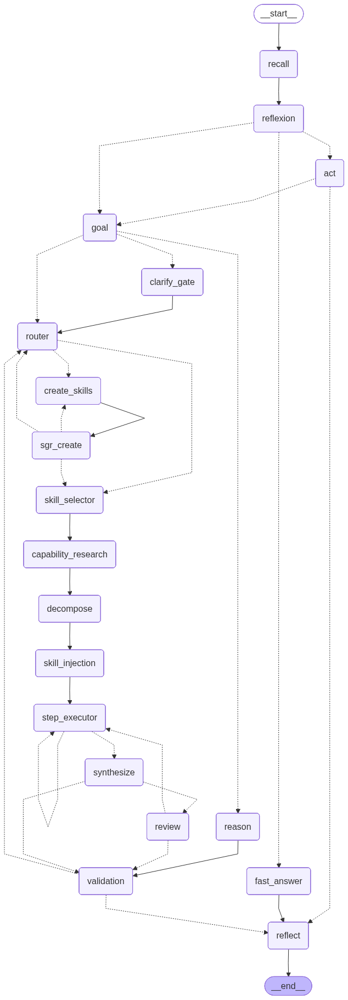

# self-extension-agent

A self-extending, self-improving personal agent built on **LangGraph**. It picks a *thinking
mode* per task, remembers the user across sessions, extends itself with skills, and **learns
from its own traces** — treating its graph as a trainable program.

Idea: a cheap model → a highly capable agent through the **harness**, not model size. Useful to
everyone via **per-user optimization** (personalization = the path to universality), keeping
context compact through **context engineering**.

Architectural principle — the **amortized agent**: with ReAct / plan-execute the cost per task is
~constant; here every successful run leaves an artifact (pattern → habit → skill) that makes
similar tasks cheaper and more reliable. Proven on a live bench: a warm pass is **−13% tokens
with quality rising 78%→98%** (`scripts/amortize_bench.py`).

## Architecture

The real compiled LangGraph — `build_graph().get_graph().draw_mermaid_png()`, every node and
conditional route (dashed = conditional routing, solid = unconditional):



Conceptual, annotated view (editable in diagrams.net): [`docs/architecture.en.drawio`](docs/architecture.en.drawio).
Full write-up — see [`ARCHITECTURE.md`](ARCHITECTURE.md).

> 🇷🇺 **Русская версия — [ниже](#self-extension-agent-русская-версия).**

---

## Benchmarks & results

Honest numbers from live runs — not benchmark-tuned. Two model tiers measured on GAIA (n=100 each).

**GAIA (held-out validation, all levels, `EVAL_MODE`, default budget, resilient runner):**

| run | Overall (95% Wilson) | L1 | L2 | L3 | Cost (est.) |
|---|---|---|---|---|---|
| baseline (n=20, before fixes) | 15% [5–36%] | 29% | 14% | 0% | $0.16 |
| cheap tier (`gemini-2.5-flash-lite` + `deepseek-v4-flash`), n=100 | 20% [13–29%] | 41% | 5% | 12% | $0.81 |
| **strong tier (`gemini-3.1-flash-lite` + `glm-5.1` + `deepseek-v4-pro`), n=100** | **33% [24.6–42.7%]** | **49%** | **38%** | 4% | $0.45\* |

The **strong tier is +13pp overall (20%→33%)**, driven mostly by **L2 5%→38%** (multi-hop —
glm-5.1 / deepseek-v4-pro are much stronger on agentic chains); L3 dropped within noise (1–3 tasks,
huge CI). It costs MORE per token, not less (glm-5.1 $0.98/$3.08 vs deepseek-v4-flash $0.09/$0.18);
the `$` figures are `usage.py` estimates on a flat rate and **undercount the strong tier** (\*real
cost is several× higher). Aggregate Wilson intervals overlap → the gain is real but not yet
significant at n=100; the L2 gap is solid. An earlier cheap-tier run scored 23% (run-to-run variance).
Context: GPT-4+plugins score ~15% on GAIA; top agents ~40–50% on L1 only.
Reproduce: `AGENT_EVAL_MODE=1 AGENT_NO_BROWSER=1 python scripts/gaia_resilient.py 100 --jsonl data/eval/gaia100.jsonl`.

**Universal intent router** (`src/eval/route_eval.py`, 570 labeled multilingual cases, ~100/class,
held out of the seed): **89.3%** overall — `media_control` 93%, `physical_browser` 96%,
`self_contained` 91%, `web_grounding` 86%, `play_media` 80%. Multilingual via embeddings, incl.
**ja/zh/ar/ko/hi** outside the seed. (`play`↔`media_control` are semantically close → ~20% of
play routes to media_control, but a misrouted play still gets browser hands and the act prompt
plays — only the deterministic nudge is lost; pauses now route correctly instead of auto-playing.)
Reproduce: `python -m src.eval.route_eval`.

**Amortization** (`scripts/amortize_bench.py`): one paired cold→warm run over 4 tasks (a fresh
user, then the *same* user now carrying patterns/few-shots/priors) — the warm pass spends
**−13% tokens at no worse quality** (confidence 78%→98%). This shows the *mechanism* (a warm pass
reuses compiled patterns), not a statistical claim — a series with medians is still needed.
**Tests:** 281, mostly offline (no LLM).

> Caveats: GAIA n=100 → per-level CIs are wide; route_eval threshold is calibrated on its own
> set (single hyperparameter, low overfit risk); confidence numbers are validator self-assessment.

## What it does

- **6 thinking modes (Any-2-Any)** — a meta-controller picks per task, like a human:
  `fast` (intuitive), `reason` (deep step-by-step), `act` ("System 1 with hands": ONE direct
  action in 1–2 tools without planning; if it fails — auto-escalation to deliberate),
  `deliberate` (tools + decomposition + per-step execution/validation), `heavy` (large task:
  same plus an **end-to-end review of the assembled solution** and a refinement round),
  `clarify` (ask back). Budget is built in: simple tasks don't take the expensive path, the
  pricey deep model is called only in heavy-review. The choice is aided by a **bandit prior**
  (Beta/Thompson over the user's similar episodes — it sees failures too, which few-shots don't
  carry; config `agent.bandit_prior`). The heavy end-to-end review is **earned** by runtime
  evidence (artifact is large + multi-step + has a rubric), not guessed upfront — the "up"
  misclass into heavy is the most expensive, so we pay for review on demand.
- **Universal intent router (any language)** (`src/intent.py`) — front-of-pipeline signals (needs
  web grounding / physical browser / media playback) are decided by an embedding-kNN "route
  codebook", not Russian-lexicon regexes: multilingual (es/de/fr/… caught via embeddings); the
  routing regexes are **removed** — the classifier alone decides, in any language (output-parsing
  regexes for fabricated URLs / degenerate repeats / paywalls stay; those aren't the user's
  language). The codebook **grows from the feedback loop** (validated run → the route that worked),
  **reuses the query embedding from recall** (zero extra calls in the hot path), is pinned per model
  (model change → re-seed). A 5th label `media_control` (pause/stop/volume) keeps "pause" from
  triggering auto-play. Statistical eval: `python -m src.eval.route_eval` (570 cases, ~100/class,
  incl. ja/zh/ar): **accuracy 89.3%** (media_control 93 · physical 96 · self 91 · web 86 · play 80). The route
  corpus (pos/neg, reward 0/1) accumulates for a future trained local head (kNN tuning / CatBoost
  / fine-tuned embedder).
- **Experience amortization (patterns + habits + collective tier)** — a successful expensive run
  compiles into a **pattern** (plan + skills): a similar task then runs without selector LLM calls
  and (when very similar) without decomposition; a losing pattern self-removes. A recurring task
  type (a **habit**) → the agent creates a reusable skill for it. A **collective tier**
  (`collective.py`): a pattern that proved itself for one user becomes an install best-practice and
  is recommended to **similar** people (query + profile matching); personal always wins,
  injections aren't promoted.
- **User knowledge base** (`/kb`) — personal documents in a folder hierarchy, a graph on
  **real LightRAG** (entities + relations, multi-hop), BM25 fallback without a key; graph
  indexing comes with a cost estimate and confirmation (`/kb add` doesn't spend silently). Session
  attachments (`/attach`) are temporary, cleaned at the end. **AutoRAG**: recall itself blends in
  relevant chunks (cheap, BM25 + anti-injection sanitize) — the agent answers from your files
  without an explicit tool call.
- **Interaction journal → implicit feedback** — HITL decisions and answers to clarifications
  survive the run: a refusal → the fact "don't do X unasked", an answer → a profile fact
  (cumulative onboarding). Zero LLM in the hot path.
- **Full browser actions** (`browser_control`): play a track/video, find and start music, click a
  button, fill a form. STRUCTURAL control: the page is seen as a numbered list of DOM elements (a
  snapshot), click/type by number — not blind keystrokes over a screenshot, no Accessibility
  permissions. A visible Chromium window with a persistent profile: logins survive sessions.
  Viewing a page — without confirmations; actions — under HITL. Showing a link in the user's main
  browser — `device_control.open_url`; headless search — only for background fact-gathering. The
  per-step validator sees the actually-called tools: "opening mail" as text without a tool call =
  step not done.
- **Silent profiling** — the agent builds the user profile (role, style, preferences) from the
  conversation itself, without a canned self-introduction or "how should I address you?" greeting.
- **Temporary skills** — a skill created for a task is tagged `temp`; after solving, a retention
  judge decides: accept into the library (reusable) or delete (one-off). Unaccepted skills are
  cleaned by TTL at startup — the library doesn't fill with junk.
- **Goal-setting** — determines the goal and keeps a "standing" goal + rubric in context.
- **Onboarding of an unclear task (a system property, not one node)** — ambiguity is caught at
  three points: at the input (high ambiguity → routed to the **structured `clarify_gate`**, not a
  prose re-ask), at planning (`clarify_gate` — a batch of precise questions: markers where the set
  is finite, open-ended where not; in the GUI rendered as a **multiselect Q/A card**), and right in
  execution (the `ask_user` tool — a catch-up at a fork). All questions/answers accumulate into a
  single **clarification registry** per run and are reused by all nodes — the agent doesn't ask
  twice (deduped, and carried within the run). No answer/channel → a reasonable assumption with a "I assumed that…" note in the final
  (doesn't block autonomous work).
- **Memory** — episodic/semantic (facts + tags)/conclusions/goals/summaries, graph edges
  (**GraphRAG-lite**: densify `fact↔fact` by cosine + spreading-activation from relevant episodes
  — associative recall, per-user, PII containment), TurboVec ANN, **conditional recall** (persona
  facts always, associative memory — gated by relevance `recall_gate`, "recall shouldn't always
  fire"), the query is embedded ONCE and reused, overflow protection (prune).
- **Memory-as-TOOL (3 tiers)** — the agent itself decides what to pull: `search_memory` (global
  long-term), `recall_history` (drill-back — restore a FULL past episode from a compact index),
  `note_to_self`/`read_my_notes` (temporary runtime memory, not persisted). Not just auto-inject —
  memory as a tool.
- **Personalization** — extracts stable facts about the user (multi-role), applies them
  everywhere INTERNALLY (roles are never named aloud).
- **Self-learning (forward + backward, incl. PER-USER)** — forward (collecting few-shots from
  wins, global and personal) + backward (textual gradients over the trace: diff credit-assignment
  → per-node critique → prompt optimization). **Per-user backward** (`graph_backward_user`): from a
  specific user's failures + WHO they are, it synthesizes corrective lessons → their personal
  few-shots (the core is frozen, few-shots are the reversible channel). **Measurable
  accept/revert**: a prompt edit is kept only if an internal before/after run on cases showed
  improvement, otherwise reverted. Two-tier few-shots: a built-in baseline + trainable. Triggered
  by degradation/inactivity, not every iteration.
- **Skills** — creates new skills with smoke tests (skill library), protects the core ones,
  auto-syncs the registry.
- **ToolSearch** — as the library grows, the selector doesn't get the WHOLE registry but a BM25
  retrieval of the top-relevant skills for the query (`src/retrieval.py`). Scales tool choice.
- **MCP — discover/connect/use** — `discover_mcp` (official registry) + a trusted catalog; on a
  capability gap the agent finds and (with confirmation, or automatically in eval mode
  `AGENT_UNLEASH`) connects an MCP server and solves the task with it.
- **Importing OpenClaw skills** — `import_openclaw_skill` takes a ClawHub skill (the `SKILL.md`
  format) from a local directory or a GitHub URL and wraps it into our format: instructions are
  injected to the executor, while the CLI is invoked via an allowlist of binaries
  (`requires.bins` ∪ `install[].bins`) with timeout/dry-run. An imported (third-party) skill is
  always under human-in-the-loop. So the OpenClaw ecosystem becomes your library.
- **Tracing and self-diagnosis** — spans per node, finding one's own "mistakes" and degradation.
- **Device actions (on-demand, cross-platform)** — open a site/app, screenshot + **vision screen
  analysis** (`analyze_screen`), notification, TTS: backends for macOS/Linux/Windows. Working with
  open windows (scroll/type/AX, Telegram) — macOS for now.
- **DeepAgent (an add-on)** — for long-horizon/file subtasks (virtual FS, todo, sub-agents),
  called from a step without replacing the core.
- **Fresh web search + context engineering** — search: SearXNG (private) → urllib-DDG →
  cloakbrowser (stealth); an unavailable SearXNG goes into cooldown. Reading a page does NOT feed
  the whole page to the agent: **trafilatura** (HTML cleanup) → chunking → **BM25S** (lexical) →
  **vector-rerank** (OpenRouter embeddings) → only relevant chunks into context. Page reading —
  urllib+trafilatura first (fast), the browser only for bot walls.
- **Universal file assistant** — PDF (tiered parser), Excel, Word, **PowerPoint**, text, images
  (vision), audio (transcript), **video/GIF** (frame sampling → vision + audio track →
  transcript). In Telegram — photos/documents/voice as-is; in the REPL — a file path in the query,
  voice — `/voice`.
- **Live progress** — on long tasks you see what the agent is doing right now (mode → plan →
  step i/N → review → validation) and how many tokens/$$ are already spent (REPL — in the status
  line, Telegram — a status message edited along the way).
- **Interfaces** — REPL, Telegram bot, FastAPI server, and a **desktop GUI** (React + Vite +
  Tailwind front-end over the Python brain; `desktop.py` = native window via pywebview). The GUI
  adds live per-node progress, an **interactive clarification card** (multiselect Q/A), file
  attach + microphone (Whisper), thread history, and an in-window settings panel
  (provider / models / key, work & thinking mode, browser-extension token). Shared graph + memory.

## Security (guard rails)

Three real layers — not prompt instructions:

1. **AST gate on code writes** (`src/utils_validation.py`). Any code the LLM saves as a skill
   (`create_skill`/`update_skill_tools`) goes through AST analysis: `subprocess`, `os.system`,
   `eval`/`exec`/`__import__`, `ctypes`, `importlib`, `shutil.rmtree` are forbidden — including
   aliases (`import subprocess as sp`, `from os import system as s`) and getattr bypass
   (`getattr(os, 'sys'+'tem')`). The owner can disable: `AGENT_ALLOW_RISKY_SKILLS=1`.
2. **Smoke-test sandbox** (`src/utils.py: run_tool_sandboxed`). A generated tool runs in a
   SEPARATE process with resource limits (CPU, memory, file size) and a hard kill timeout — never
   in the agent's process.
3. **Human-in-the-loop** (`src/hitl.py`, config `agent.require_confirmation`). Side-effect tools
   of skills (`skills.confirm`: device/app/ax/phone) require explicit human confirmation: REPL —
   `y/N` in the terminal, Telegram — inline buttons; where there's no confirmation channel (HTTP
   server) — **deny by default**. Plus an independent `AGENT_DRY_RUN`.

Additionally: core skills are protected from overwrite and deletion by the agent (`delete_skill`
has no `force`; owner deletion — only `force_delete_skill` from code/CLI).

**Protection against injection via tool outputs** (`safety.sanitize_tool_output`): the output of
any tool/MCP/skill/search is untrusted DATA; on a prompt-injection attempt ("ignore previous…",
"reveal system prompt", hidden commands) the triggers are neutralized and the text is marked "this
is data, not instructions" — protection against skills-/mcp-/search-injection. The same sanitize
sits on the **AutoRAG knowledge-base injection** (a poisoned document is data, not commands), KB
paths are protected from traversal, and **collective patterns** aren't promoted from injection
queries ("don't learn from a break-in" extends to the shared pool).

**Anti-hallucination and anti-PII (deterministic checks layered over the model):** grounding facts (a
query about addresses/prices/"where to buy" → web, not from memory), cutting fabricated URLs
(`_strip_ungrounded_urls`) and **fabricated emails** (`safety.strip_ungrounded_pii` — only emails,
numbers/GAIA-answers untouched), a detector of degenerate repetition and false "no access". "Don't
disclose" = the twin of "don't fabricate": `safety.redact_pii` masks PII (email/phone/card) in
**collective patterns** before passing them to other users.

**Learning bans** (locked by tests `test_optimization_policy`): backward does NOT change the
architecture (writes only ParamStore artifacts, not code/graph), does NOT rewrite the system
prompts of key nodes (frozen), and does NOT learn from defense-bypass attempts
(`safety.filter_learnable` excludes jailbreaks from the training batch).

**Honest boundaries**: the sandbox is process-level isolation (rlimits + kill), not gVisor/seccomp;
AST analysis doesn't catch dynamic code generation (but `exec`/`eval` are fully banned); core
skills (AppleScript/AX/adb) run trusted — the owner wrote them. Device/app/ax skills are currently
**macOS-only**; Linux/Windows backends — on the roadmap.

## Install

```bash
uv sync
.venv/bin/python -m playwright install chromium   # for cloakbrowser search
```

## Configuration

`.env` (template — `.env.example`, the file is in `.gitignore`, not committed):
```
OPEN_ROUTER_API_KEY=...              # required (LLM AND embeddings via OpenRouter)
SEARXNG_URL=http://localhost:8080    # opt. — private fresh search
TELEGRAM_BOT_TOKEN=...               # opt. — for the Telegram bot
# OPENAI_API_KEY=...                 # opt. — alternative to OpenRouter for embeddings

# Embeddings (semantic recall + TurboVec) are enabled in config.yml: memory.embeddings=true
# and go through OpenRouter with the same OPEN_ROUTER_API_KEY (model — memory.embedding_model).
```

`config.yml`: models, `memory.*` (recall/embeddings/caps), `skills.protected/autosync`,
`improve.*` (self-improvement trigger).

### Low-cost model tiers (prices verified via the OpenRouter API)

| Tier | Model | $/M in/out | Used for |
|---|---|---|---|
| fast | `google/gemini-3.1-flash-lite` | 0.25 / 1.50 | routing, validation, extraction, fast/reason |
| code | `z-ai/glm-5.1` | 0.98 / 3.08 | agentic step execution, code, ctx 1M |
| deep | `deepseek/deepseek-v4-pro` | 0.435 / 0.87 | ONLY heavy-review (1–2 calls per large task) |

> Earlier cheap tier (lower GAIA, far cheaper): fast `gemini-2.5-flash-lite` 0.10/0.40,
> code `deepseek-v4-flash` 0.09/0.18 — swap in `config.yml` to trade accuracy for cost.

A typical fast query ≈ $0.001; deliberate ≈ $0.005–0.02; heavy adds 1–2 deep calls.

## Run

```bash
.venv/bin/python main.py                 # REPL
.venv/bin/python bot.py                  # Telegram bot
uvicorn src.server:app --port 8000       # HTTP API
```

API: `POST /chat {user_id, query}`, `GET /diagnose`, `/memory/facts`, `/memory/goal`, `/traces`.

REPL commands: `/kb add|ls|mkdir|find` (knowledge base, LightRAG graph), `/attach <file>`
(session attachment), `/model /voice /facts /goal /diagnose /traces /improve /usage /new`.

## Self-learning & maintenance (CLI)

```bash
python -m src.improve --graph     # backward over the graph: credit assignment + per-node optimization
python -m src.improve --list      # accepted parameters/few-shots
python -m src.tracing             # self-diagnosis over traces
python -m src.maintenance         # safe auto-update of dependencies (with rollback)

# Import an OpenClaw skill (local directory or GitHub URL):
python -m src.tools.openclaw_import https://github.com/openclaw/openclaw/tree/main/skills/github

# Verify the amortization thesis (PAID live run, ~1–2 cents):
python scripts/amortize_bench.py

# Statistical eval of the universal intent router (570 labeled multilingual cases):
python -m src.eval.route_eval

# GAIA held-out (fault-tolerant — survives a native crash, resumed from the JSONL):
AGENT_EVAL_MODE=1 AGENT_NO_BROWSER=1 python scripts/gaia_resilient.py 100 --jsonl data/eval/gaia100.jsonl
```

## Tests

```bash
.venv/bin/python -m pytest tests/ -q   # 272 tests, mostly without LLM (memory/retrieval/router/security/…)
```
Graph-build tests require an API key (the LLM is built on import), the rest run offline.
A quick pass of everyday scenarios through the real graph: `python -m src.eval.daily_eval [N]`.
Statistical routing eval (multilingual, 570 cases): `python -m src.eval.route_eval`.

## Structure

```
src/
  agent.py            graph (recall→goal→reflexion→{fast|reason|act|deliberate|heavy}→…→reflect)
  prompts.py          prompts + registry of trainable ones (OPTIMIZABLE_PROMPTS)
  structured_outputs.py
  memory/             store(SQLite: episodes/facts/recipes) + embedder + vector_index(TurboVec) + feedback
  memory_tools.py     memory-as-tool (3 tiers: search_memory / recall_history / scratch)
  knowledge_base.py   user knowledge base (/kb, folder hierarchy) + session attachments (/attach)
  lightrag_engine.py  KB graph on LightRAG (per-user, indexing cost estimate)
  interaction.py      interaction journal (HITL/clarify → profile facts, no LLM)
  habits.py           habits: recurring expensive runs → directive to create a skill
  bandit.py           Beta/Thompson prior for mode choice from the user's episodes
  collective.py       collective patterns (install best-practices, profile matching)
  retrieval.py        canonical BM25S ranker (ToolSearch et al.)
  improve/            prompt_store(ParamStore) + optimizer + pipe + graph_learn + safety
  mcp_client.py       discover/connect/use MCP (registry + trusted catalog)
  subagents.py        sub-agents/sub-graphs as tools
  clarify.py          clarification registry (onboarding-by-execution)
  runbudget.py        token/time budget for a run (anti-runaway)
  media.py            files (pdf/excel/docx/pptx/video/gif/image/audio)
  tracing/            tracer(spans) + diagnose
  external/           A2A/MCP context   ·  maintenance/  dependency auto-update
  tools/              skill manager (create/protect/autosync/ToolSearch)
  skills/             skills (web_search, device_control, deep_agent, stash, …)
  eval/               daily_eval / gaia_runner / assistantbench_runner
  server.py           FastAPI
scripts/              amortize_bench.py (amortization-thesis check)
main.py / bot.py      REPL / Telegram
```

## Status

Implemented and tested (272 tests): the core, **6 thinking modes** (incl. act with
auto-escalation; **heavy review earned by runtime evidence**), a **universal embedding intent
router** (any language, route_eval 89.3%), **conditional recall + GraphRAG-lite memory**, per-step
execution with **action grounding** + **context masking**, memory + **memory-as-tool (3
tiers)** + **a LightRAG knowledge base** (+AutoRAG), personalization + **an interaction journal**,
**per-user self-improvement** + measurable accept/revert, **experience amortization**
(patterns/habits/collective tier; live bench: −13% tokens, quality 78%→98% on a warm pass), a
**mode bandit prior**, **reflexion grounding** (anti-hallucination), **context search**
(trafilatura→BM25S→vector) + browser-first for the interactive web, **ToolSearch**, MCP
discover/connect/use, defense (AST→sandbox→HITL + **anti-injection in tool outputs and AutoRAG** +
learning bans, incl. collective), universal files (pdf/excel/docx/pptx/video/gif/audio),
tracing/self-diagnosis, on-demand device (cross-platform), DeepAgent, eval harnesses
(daily/GAIA/AssistantBench/amortize), REPL/Telegram/FastAPI.

Deferred (see `ARCHITECTURE.md`): a trained local route-selection model (kNN tuning / CatBoost on
the accumulated examples); replacing the hard regex "is web search needed?" check with a learned
classifier — but only after verifying it won't increase fabricated answers; raising L2/L3 GAIA
(multi-step tasks + files — the cheap-tier ceiling); free dynamic composition of modules (the
act→deliberate ladder is the first step); inheriting strong MCPs via before/after comparison;
anonymizing saved task playbooks (patterns) before sharing them with similar users; cross-platform
UI automation outside macOS.

## License

**PolyForm Noncommercial License 1.0.0** — see [`LICENSE`](LICENSE). Free for any
**noncommercial** purpose (personal, research, education, hobby, nonprofit/government). Commercial
use requires a separate license from the author. Copyright © 2026 Yaroslav Sergaev (adelardw).

---
---

# self-extension-agent (Русская версия)

Самораширяющийся, самообучающийся персональный агент на **LangGraph**. Сам выбирает
тип мышления под задачу, помнит пользователя между сессиями, расширяет себя навыками
и **обучается на собственных трейсах**, относясь к своему графу как к обучаемой программе.

Идея: дешёвая модель → высокоспособный агент за счёт **harness**, не размера модели.
Полезен каждому через **оптимизацию под конкретного пользователя** (персонализация =
метод универсальности), держа контекст компактным через **контекстный инжиниринг**.

Архитектурный принцип — **амортизированный агент**: у ReAct/plan-execute стоимость задачи
~постоянна, здесь каждый успешный прогон оставляет артефакт (паттерн → привычка → навык),
делающий похожие задачи дешевле и надёжнее. Проверено живым бенчем: тёплый проход
**−13% токенов при росте качества 78%→98%** (`scripts/amortize_bench.py`).

## Архитектура

Реальный скомпилированный LangGraph — `build_graph().get_graph().draw_mermaid_png()`, все узлы
и условные маршруты (пунктир = условный роутинг, сплошная = безусловный переход):


Концептуальная аннотированная схема (редактируется в diagrams.net): [`docs/architecture.drawio`](docs/architecture.drawio).
Полное описание — в [`ARCHITECTURE.md`](ARCHITECTURE.md).

## Бенчмарки и результаты

Честные числа из живых прогонов — не подгонялись под бенч. Два тира моделей замерены на GAIA (n=100 каждый).

**GAIA (held-out валидация, все уровни, `EVAL_MODE`, дефолтный бюджет, отказоустойчивый раннер):**

| прогон | Overall (95% Wilson) | L1 | L2 | L3 | Cost (оценка) |
|---|---|---|---|---|---|
| baseline (n=20, до фиксов) | 15% [5–36%] | 29% | 14% | 0% | $0.16 |
| дешёвый тир (`gemini-2.5-flash-lite` + `deepseek-v4-flash`), n=100 | 20% [13–29%] | 41% | 5% | 12% | $0.81 |
| **сильный тир (`gemini-3.1-flash-lite` + `glm-5.1` + `deepseek-v4-pro`), n=100** | **33% [24.6–42.7%]** | **49%** | **38%** | 4% | $0.45\* |

**Сильный тир — +13pp overall (20%→33%)**, в основном за счёт **L2 5%→38%** (мультихоп —
glm-5.1 / deepseek-v4-pro заметно сильнее на агентских цепочках); L3 просел в шуме (1–3 задачи,
огромный CI). Он ДОРОЖЕ за токен, а не дешевле (glm-5.1 $0.98/$3.08 vs deepseek-v4-flash $0.09/$0.18);
числа `$` — оценка `usage.py` по единой ставке и **занижают сильный тир** (\*реальная цена в разы выше).
Агрегатные Wilson-интервалы пересекаются → прирост реален, но на n=100 ещё не статзначим; по L2 разрыв
уверенный. Более ранний прогон дешёвого тира дал 23% (run-to-run разброс). Контекст: GPT-4+плагины дают
~15% на GAIA; топ-агенты ~40–50% только на L1. Воспроизведение:
`AGENT_EVAL_MODE=1 AGENT_NO_BROWSER=1 python scripts/gaia_resilient.py 100 --jsonl data/eval/gaia100.jsonl`.

**Универсальный роутер интентов** (`src/eval/route_eval.py`, 570 размеченных мультиязычных кейсов,
~100/класс, вне seed): **89.3%** overall — `media_control` 93%, `physical_browser` 96%,
`self_contained` 91%, `web_grounding` 86%, `play_media` 80%. Мультиязычность через эмбеддинги, вкл.
**ja/zh/ar/ko/hi** вне seed. (`play`↔`media_control` семантически близки → ~20% play уходит в
media_control, но ошибочная маршрутизация play не ломает воспроизведение — браузеру передаётся управление, act играет;
теряется лишь детерминированное доведение; зато «пауза» больше не запускает плей.)
Воспроизведение: `python -m src.eval.route_eval`.

**Амортизация** (`scripts/amortize_bench.py`): один парный прогон cold→warm на 4 задачах (свежий
юзер, затем *тот же* юзер — теперь с паттернами/few-shots/априорными оценками) — тёплый проход тратит
**−13% токенов при не худшем качестве** (уверенность 78%→98%). Это демонстрация *механизма*
(тёплый проход переиспользует скомпилированные паттерны), а не статистическое утверждение —
для строгости нужна серия с медианами. **Тесты:** 281, в основном оффлайн (без LLM).

> Caveats: GAIA n=100 → доверительные интервалы по уровням широкие; порог route_eval откалиброван
> на своём же наборе (один гиперпараметр, риск оверфита низкий); confidence — самооценка валидатора.

## Что умеет

- **6 типов мышления (Any-2-Any)** — мета-контроллер сам выбирает по анализу задачи,
  как человек: `fast` (интуитивно), `reason` (глубокое рассуждение), `act` («System 1
  с руками»: ОДНО прямое действие 1–2 инструментами без планирования; не вышло —
  автоэскалация в deliberate), `deliberate` (инструменты + декомпозиция + по-пунктовое
  исполнение/валидация), `heavy` (большая задача: то же + **сквозной ревью собранного
  решения целиком** и раунд доработки), `clarify` (переспросить). Бюджет встроен: простое
  не идёт по дорогому пути, дорогая deep-модель зовётся только в heavy-ревью. Выбору
  помогает **априорная оценка бандита** (Beta/Thompson по похожим эпизодам юзера — видит и неудачи,
  которых нет в few-shots; конфиг `agent.bandit_prior`). Тяжёлый сквозной ревью
  **ЗАРАБАТЫВАЕТСЯ** рантайм-evidence (артефакт большой+многошаговый+rubric), а не угадывается
  наперёд — мисс-класс «вверх» в heavy самый дорогой, поэтому платим за ревью по факту.
- **Универсальный роутер интентов (любой язык)** (`src/intent.py`) — сигналы фронта (нужен
  привязка к веб-источникам / физический браузер / воспроизведение / контроль плеера) определяет embedding-kNN
  «кодбук маршрутов», а не регулярные выражения по русскому лексикону. **Регэкспы routing'а УДАЛЕНЫ** —
  сигналы (`_needs_web_grounding` / `_wants_physical_browser` / `_is_play_intent`) теперь
  идут ТОЛЬКО через классификатор: мультиязычно (es/de/fr/ja/zh/ar/… ловятся через
  эмбеддинги, без лексиконных костылей). Кодбук **растёт из фидбек-лупа**
  (валидированный прогон → сработавший маршрут), **переиспользует эмбеддинг запроса из recall**
  (ноль лишних вызовов в hot-path), фиксирован по модели (смена → пере-seed). 5-й лейбл
  **media_control** (пауза/стоп/громкость) отделён от play_media, чтобы «поставь паузу» НЕ
  триггерил автоматический запуск воспроизведения. Стат-оценка
  `python -m src.eval.route_eval` (570 размеченных мультиязычных кейсов вкл. JA/ZH/AR/KO/HI,
  100+/класс): **accuracy 89.3%** [Wilson 86.5–91.6%] (media_control 93% · physical 96% ·
  self_contained 91% · web_grounding 86% · play_media 80% — разменивается с media_control,
  семантически близким).
  Корпус маршрутов (pos/neg, reward 0/1) копится для будущего обучения локального head
  (kNN-тюнинг / CatBoost / fine-tuned эмбеддер).
- **Амортизация опыта (паттерны + привычки + коллективный ярус)** — успешный дорогой
  прогон компилируется в **паттерн** (план+навыки): похожая задача дальше идёт без
  LLM-вызовов селектора и (при высокой похожести) декомпозиции; проигрывающий паттерн
  самоудаляется. Повторяющийся тип задач (**привычка**) → агент сам создаёт под него
  переиспользуемый навык. **Коллективный ярус** (`collective.py`): паттерн, доказавший
  себя у юзера, становится best-practice инсталляции и рекомендуется ПОХОЖИМ людям
  (матчинг запроса+профиля); личное всегда приоритетнее, инъекции не промоутятся.
- **База знаний пользователя** (`/kb`) — личные документы в иерархии папок, граф на
  **настоящем LightRAG** (сущности+связи, multi-hop), BM25 fallback без ключа; индексация
  в граф — с прикидкой цены и подтверждением (`/kb add` не тратит молча). Вложения
  сессии (`/attach`) — временные, чистятся в конце. **AutoRAG**: recall сам подмешивает
  релевантные куски (дёшево, BM25 + очистка от инъекций) — агент отвечает из твоих
  файлов без явного вызова инструмента.
- **Журнал взаимодействий → implicit feedback** — HITL-решения и ответы на уточнения
  переживают прогон: отказ → факт «не делать X без просьбы», ответ → факт профиля
  (онбординг накопительный). Ноль LLM в горячем пути.
- **Действия в браузере — полноценные** (`browser_control`): включить трек/видео, найти
  и запустить музыку, нажать кнопку, заполнить форму. СТРУКТУРНОЕ управление: страница
  видится нумерованным списком DOM-элементов (снимок), клик/ввод по номеру — не слепые
  клавиши по скриншоту и без Accessibility-прав. Видимое Chromium-окно с постоянным
  профилем: логины переживают сессии. Смотреть страницу — без подтверждений, действия —
  под HITL. Показ ссылки в основном браузере юзера — `device_control.open_url`;
  headless-поиск — только фоновый сбор фактов. По-пунктовый валидатор видит реально
  вызванные инструменты: «открываю почту» текстом без вызова инструмента = шаг не выполнен.
- **Тихое профилирование** — агент строит профиль пользователя (роль, стиль, предпочтения) из
  самого диалога, без дежурного «Привет, я твой ассистент… как к тебе обращаться?».
- **Временные навыки** — навык, созданный под задачу, помечается `temp`; после решения
  retention-судья решает: принять в библиотеку (переиспользуем) или удалить (одноразовый).
  Не принятые навыки чистятся по TTL при старте — библиотека не зарастает мусором.
- **Целеполагание** — определяет цель и держит «стоящую» цель + rubric в контексте.
- **Онбординг неясной задачи (свойство системы, не одна нода)** — неоднозначность
  ловится в трёх точках: на входе (высокая неоднозначность → в **структурный `clarify_gate`**,
  а не переспрос прозой), при планировании (`clarify_gate` — батч точных вопросов: маркеры где
  набор конечен, открытые где нет; в GUI — **карточка Q/A с мультиселектом**) и прямо в исполнении
  (инструмент `ask_user` — догон на развилке). Все вопросы/ответы копятся в один **реестр
  уточнений** на прогон и переиспользуются всеми нодами — агент не переспрашивает дважды (дедуп). Нет ответа/канала → разумное допущение с пометкой
  «исходил из того, что…» в финале (не блокирует автономную работу).
- **Память** — эпизодическая/семантическая (факты+тэги)/выводы/цели/саммари, граф-рёбра
  (**GraphRAG-lite**: densify `fact↔fact` по cosine + spreading-activation от релевантных
  эпизодов — ассоциативный recall, per-user, PII-контейнмент), TurboVec-ANN, **условный
  recall** (ГИБКО: И факты, И ассоциативная память отбираются по релевантности к запросу
  `recall_gate` — «recall не всегда», task-факты одной задачи не текут в несвязанный запрос),
  запрос эмбеддится ОДИН раз и переиспользуется, защита от
  переполнения (prune).
- **Память-как-TOOL (3 яруса)** — агент САМ решает, что подтянуть: `search_memory`
  (глобальная долгая), `recall_history` (drill-back — восстановить ПОЛНЫЙ прошлый эпизод
  из компактного индекса), `note_to_self`/`read_my_notes` (временная runtime-память,
  не персистится). Не только автоматическое добавление — память как инструмент.
- **Персонализация** — извлекает устойчивые факты о пользователе (мульти-роль), учитывает
  их везде ВНУТРЕННЕ (роли не называются вслух).
- **Самообучение (forward + backward, в т.ч. ПЕР-ЮЗЕР)** — forward (сбор few-shots из удач,
  глобальных и персональных) + backward (textual-gradients по трейсу: дифф-credit-assignment
  → per-node критика → оптимизация промптов). **Per-user backward** (`graph_backward_user`):
  из неудач конкретного юзера + того, КТО он, синтезирует корректирующие уроки → его
  персональные few-shots (ядро заморожено, few-shots — обратимый канал). **Измеримый
  accept/revert**: правка промпта сохраняется только если внутренний прогон ДО/ПОСЛЕ на
  кейсах показал улучшение, иначе откат. Двухъярусные few-shots: встроенный baseline +
  обучаемые. Триггер — по деградации/неактивности, не каждую итерацию.
- **Навыки** — создаёт новые навыки со smoke-тестами (skill library), защищает базовые,
  авто-синхронизирует реестр.
- **ToolSearch** — при росте библиотеки селектор не получает ВЕСЬ реестр, а BM25-retrieval
  топ-релевантных навыков под запрос (`src/retrieval.py`). Масштабирует выбор инструментов.
- **MCP — поиск/подключение/использование** — `discover_mcp` (официальный реестр) +
  доверенный каталог; на capability-gap агент находит и (с подтверждением, либо авто в
  eval-режиме `AGENT_UNLEASH`) подключает MCP-сервер и решает им задачу.
- **Импорт OpenClaw-скиллов** — `import_openclaw_skill` берёт навык ClawHub (формат
  `SKILL.md`) из локального каталога или GitHub-URL и оборачивает в наш формат:
  инструкции инъектятся исполнителю, а CLI вызывается через allowlist бинарников
  (`requires.bins` ∪ `install[].bins`) с timeout/dry-run. Импортированный (сторонний)
  навык всегда под human-in-the-loop. Так экосистема OpenClaw становится твоей библиотекой.
- **Трейсинг и самодиагностика** — спаны по нодам, поиск своих «косяков» и деградации.
- **Действия с устройством (on-demand, кроссплатформенно)** — открыть сайт/приложение,
  скриншот + **vision-анализ экрана** (`analyze_screen`), уведомление, TTS: бэкенды под
  macOS/Linux/Windows. Работа с открытыми окнами (скролл/ввод/AX, Telegram) — пока macOS.
- **DeepAgent (дополнение)** — для долгогоризонтных/файловых подзадач (виртуальная ФС,
  todo, суб-агенты), вызывается из шага, не заменяя ядро.
- **Свежий веб-поиск + контекстный инжиниринг** — поиск: SearXNG (приватный) → urllib-DDG →
  cloakbrowser (stealth); недоступный SearXNG уходит в cooldown. Чтение страницы НЕ кормит
  агенту всю страницу: **trafilatura** (чистка HTML) → чанкинг → **BM25S** (лексика) →
  **vector-rerank** (OpenRouter-эмбеддинги) → в контекст только релевантные куски. Чтение
  страниц — urllib+trafilatura первым (быстро), браузер только для бот-стен.
- **Универсальный помощник по файлам** — PDF (тиерный парсер), Excel, Word, **PowerPoint**,
  текст, картинки (vision), аудио (транскрипт), **видео/GIF** (сэмпл кадров → vision +
  аудио-дорожка → транскрипт). В Telegram — фото/документы/voice как есть; в REPL — путь
  к файлу в запросе, голос — `/voice`.
- **Живой прогресс** — при долгих задачах видно, что агент делает прямо сейчас
  (режим → план → шаг i/N → ревью → валидация) и сколько токенов/$$ уже потрачено
  (REPL — в статус-строке, Telegram — статус-сообщение редактируется по ходу).
- **Интерфейсы** — REPL, Telegram-бот, FastAPI-сервер и **десктоп-GUI** (фронт на React + Vite +
  Tailwind поверх Python-мозга; `desktop.py` = нативное окно через pywebview). GUI добавляет живой
  прогресс по узлам, **интерактивную карточку уточнений** (Q/A-мультиселект), прикрепление файлов +
  микрофон (Whisper), историю тредов и панель настроек в окне (провайдер / модели / ключ, режимы
  работы и мышления, токен расширения). Общий граф и память.

## Безопасность (guard rails)

Три реальных слоя — не промпт-инструкции:

1. **AST-гейт на записи кода** (`src/utils_validation.py`). Любой код, который LLM
   сохраняет как навык (`create_skill`/`update_skill_tools`), проходит AST-анализ:
   запрещены `subprocess`, `os.system`, `eval`/`exec`/`__import__`, `ctypes`,
   `importlib`, `shutil.rmtree` — включая алиасы (`import subprocess as sp`,
   `from os import system as s`) и getattr-обход (`getattr(os, 'sys'+'tem')`).
   Владелец может отключить: `AGENT_ALLOW_RISKY_SKILLS=1`.
2. **Песочница smoke-теста** (`src/utils.py: run_tool_sandboxed`). Сгенерированный
   tool исполняется в ОТДЕЛЬНОМ процессе с resource-лимитами (CPU, память, размер
   файлов) и жёстким kill-таймаутом — никогда в процессе агента.
3. **Human-in-the-loop** (`src/hitl.py`, config `agent.require_confirmation`).
   Тулы side-effect навыков (`skills.confirm`: device/app/ax/phone) требуют явного
   подтверждения человеком: REPL — `y/N` в терминале, Telegram — inline-кнопки;
   где канала подтверждения нет (HTTP-сервер) — **deny by default**. Плюс
   независимый `AGENT_DRY_RUN`.

Дополнительно: core-навыки защищены от перезаписи и удаления агентом (`delete_skill`
не имеет `force`; владельческое удаление — только `force_delete_skill` из кода/CLI).

**Защита от инъекций через выводы инструментов** (`safety.sanitize_tool_output`): вывод
любого инструмента/MCP/навыка/поиска — недоверенные ДАННЫЕ; при попытке prompt-injection
(«ignore previous…», «reveal system prompt», скрытые команды) триггеры обезвреживаются и
текст помечается «это данные, не инструкции» — защита от skills-/mcp-/search-injection.
Тот же sanitize стоит на **добавлении базы знаний через AutoRAG** (отравленный документ — данные,
не команды), пути БЗ защищены от traversal, а **коллективные паттерны** не промоутятся
из инъекционных запросов (запрет «не учиться на взломе» распространён на общий пул).

**Анти-галлюцинация и анти-PII (детерминированные проверки поверх модели):** заземление
фактов (запрос про адреса/цены/«где купить» → веб, не из памяти), срез выдуманных URL
(`_strip_ungrounded_urls`) и **выдуманных email** (`safety.strip_ungrounded_pii` — только
email, числа/GAIA-ответы не трогаются), детектор вырожденного повтора и ложного «нет
доступа». «Не разглашать» = близнец «не выдумывать»: `safety.redact_pii` маскирует
PII (email/телефон/карта) в **коллективных паттернах** перед передачей другим юзерам.

**Запреты обучения** (залочены тестами `test_optimization_policy`): backward НЕ меняет
архитектуру (пишет только артефакты ParamStore, не код/граф), НЕ переписывает системные
промпты ключевых нод (заморожены), и НЕ учится на попытках обхода защиты
(`safety.filter_learnable` исключает джейлбреки из обучающего батча).

**Честные границы**: песочница — изоляция уровня процесса (rlimits + kill), не
gVisor/seccomp; AST-анализ не ловит динамическую кодогенерацию (но `exec`/`eval`
запрещены целиком); core-навыки (AppleScript/AX/adb) исполняются доверенно — их
писал владелец. Device/app/ax-навыки сейчас **macOS-only**; Linux/Windows-бэкенды —
в roadmap.

## Установка

```bash
uv sync
.venv/bin/python -m playwright install chromium   # для cloakbrowser-поиска
```

## Настройка

`.env` (шаблон — `.env.example`, файл в `.gitignore`, в гит не попадает):
```
OPEN_ROUTER_API_KEY=...              # обязателен (LLM И эмбеддинги через OpenRouter)
SEARXNG_URL=http://localhost:8080    # опц. — приватный свежий поиск
TELEGRAM_BOT_TOKEN=...               # опц. — для Telegram-бота
# OPENAI_API_KEY=...                 # опц. — альтернатива OpenRouter для эмбеддингов

# Эмбеддинги (семантический recall + TurboVec) включаются в config.yml: memory.embeddings=true
# и идут через OpenRouter тем же OPEN_ROUTER_API_KEY (модель — memory.embedding_model).
```

`config.yml`: модели, `memory.*` (recall/embeddings/caps), `skills.protected/autosync`,
`improve.*` (триггер само-улучшения).

### Low-cost тиры моделей (цены проверены через OpenRouter API)

| Тир | Модель | $/M in/out | Используется для |
|---|---|---|---|
| fast | `google/gemini-3.1-flash-lite` | 0.25 / 1.50 | роутинг, валидация, extraction, fast/reason |
| code | `z-ai/glm-5.1` | 0.98 / 3.08 | агентское исполнение шагов, код, ctx 1M |
| deep | `deepseek/deepseek-v4-pro` | 0.435 / 0.87 | ТОЛЬКО heavy-ревью (1–2 вызова на большую задачу) |

> Прежний дешёвый тир (ниже GAIA, заметно дешевле): fast `gemini-2.5-flash-lite` 0.10/0.40,
> code `deepseek-v4-flash` 0.09/0.18 — переключается в `config.yml` (точность ↔ цена).

Типичный fast-запрос ≈ $0.001; deliberate ≈ $0.005–0.02; heavy добавляет 1–2 deep-вызова.

## Запуск

```bash
.venv/bin/python main.py                 # REPL
.venv/bin/python bot.py                  # Telegram-бот
uvicorn src.server:app --port 8000       # HTTP API
```

API: `POST /chat {user_id, query}`, `GET /diagnose`, `/memory/facts`, `/memory/goal`, `/traces`.

Команды REPL: `/kb add|ls|mkdir|find` (база знаний, граф LightRAG), `/attach <файл>`
(вложение сессии), `/model /voice /facts /goal /diagnose /traces /improve /usage /new`.

## Самообучение и обслуживание (CLI)

```bash
python -m src.improve --graph     # backward по графу: credit assignment + per-node оптимизация
python -m src.improve --list      # принятые параметры/few-shots
python -m src.tracing             # самодиагностика по трейсам
python -m src.maintenance         # безопасный авто-апдейт зависимостей (с откатом)

# Импорт навыка OpenClaw (локальный каталог или GitHub-URL):
python -m src.tools.openclaw_import https://github.com/openclaw/openclaw/tree/main/skills/github

# Проверка тезиса амортизации (ПЛАТНЫЙ живой прогон, ~1–2 цента):
python scripts/amortize_bench.py

# Стат-оценка universal intent-роутера (570 размеченных мультиязычных кейсов):
python -m src.eval.route_eval

# GAIA held-out (отказоустойчиво — переживает нативный краш, резюмируется по JSONL):
AGENT_EVAL_MODE=1 AGENT_NO_BROWSER=1 python scripts/gaia_resilient.py 100 --jsonl data/eval/gaia100.jsonl
```

## Тесты

```bash
.venv/bin/python -m pytest tests/ -q   # 272 теста, в осн. без LLM (память/retrieval/роутер/безопасность/…)
```
Тесты сборки графа требуют API-ключ (LLM строится на импорте), остальные — оффлайн.
Быстрый прогон повседневных сценариев через реальный граф: `python -m src.eval.daily_eval [N]`.
Стат-оценка роутинга (мультиязык, 570 кейсов): `python -m src.eval.route_eval`.

## Структура

```
src/
  agent.py            граф (recall→goal→reflexion→{fast|reason|act|deliberate|heavy}→…→reflect)
  prompts.py          промпты + реестр обучаемых (OPTIMIZABLE_PROMPTS)
  structured_outputs.py
  memory/             store(SQLite: эпизоды/факты/паттерны) + embedder + vector_index(TurboVec) + feedback
  memory_tools.py     память-как-tool (3 яруса: search_memory / recall_history / scratch)
  knowledge_base.py   база знаний юзера (/kb, иерархия папок) + вложения сессии (/attach)
  lightrag_engine.py  граф БЗ на LightRAG (per-user, прикидка цены индексации)
  interaction.py      журнал взаимодействий (HITL/clarify → факты профиля, без LLM)
  habits.py           привычки: повторяющиеся дорогие прогоны → директива создать навык
  bandit.py           Beta/Thompson — априорная оценка выбора режима по эпизодам юзера
  collective.py       коллективные паттерны (best-practice инсталляции, профиль-матчинг)
  retrieval.py        канонический BM25S-ранкер (ToolSearch и др.)
  improve/            prompt_store(ParamStore) + optimizer + pipe + graph_learn + safety
  mcp_client.py       discover/connect/use MCP (реестр + доверенный каталог)
  subagents.py        под-агенты/под-графы как инструменты
  clarify.py          реестр уточнений (онбординг-по-исполнению)
  runbudget.py        токен/время-бюджет прогона (анти-runaway)
  media.py            файлы (pdf/excel/docx/pptx/видео/gif/image/audio)
  tracing/            tracer(спаны) + diagnose
  external/           контекст A2A/MCP   ·  maintenance/  авто-апдейт зависимостей
  tools/              менеджер навыков (создание/защита/автосинк/ToolSearch)
  skills/             навыки (web_search, device_control, deep_agent, stash, …)
  eval/               daily_eval / gaia_runner / assistantbench_runner
  server.py           FastAPI
scripts/              amortize_bench.py (проверка тезиса амортизации)
main.py / bot.py      REPL / Telegram
```

## Статус

Реализовано и протестировано (272 теста): ядро, **6 режимов мышления** (вкл. act с
автоэскалацией; **heavy-ревью зарабатывается рантайм-evidence**), **универсальный
embedding-роутер интентов** (любой язык, route_eval 89.3%), **условный recall + GraphRAG-lite
память**, по-пунктовое исполнение с **заземлением действий** + **маскинг контекста**, память +
**память-как-tool (3 яруса)** + **база знаний на LightRAG** (+AutoRAG), персонализация +
**журнал взаимодействий**, **per-user само-улучшение** + измеримый accept/revert,
**амортизация опыта** (паттерны/привычки/коллективный ярус; живой бенч: −13% токенов,
качество 78%→98% на тёплом проходе), **априорная оценка режима (бандит)**, **reflexion-обоснованность**
(анти-галлюцинация), **контекстный поиск** (trafilatura→BM25S→vector) + браузер-первичность
для интерактивного веба, **ToolSearch**, MCP discover/connect/use, защита (AST→песочница→
HITL + **защита от инъекций в выводах инструментов и AutoRAG** + запреты обучения, в т.ч.
коллективного), универсальные файлы (pdf/excel/docx/pptx/видео/gif/аудио),
трейсинг/самодиагностика, device on-demand (кроссплатформенно), DeepAgent, eval-harness
(daily/GAIA/AssistantBench/amortize), REPL/Telegram/FastAPI.

Отложено (см. `ARCHITECTURE.md`): обучаемая локальная модель выбора маршрута поверх
накопленного корпуса pos/neg (kNN-тюнинг / CatBoost / fine-tuned эмбеддер) — сейчас роутер
работает на seed-кодбуке + фидбек-лупе без обучаемого head;
подъём L2/L3 GAIA (многошаговые задачи + файлы — предел дешёвого тира); свободная динамическая
композиция модулей (лестница act→deliberate — первый шаг); наследование сильных MCP через
сравнение «до/после»; обезличивание сохранённых сценариев (паттернов) перед тем как делиться ими
с похожими пользователями; кроссплатформенный UI-automation вне macOS.

## Лицензия

**PolyForm Noncommercial License 1.0.0** — см. [`LICENSE`](LICENSE). Бесплатно для любого
**некоммерческого** использования (личное, исследования, образование, хобби, НКО/госструктуры).
Коммерческое использование — только по отдельной лицензии от автора.
Copyright © 2026 Yaroslav Sergaev (adelardw).
